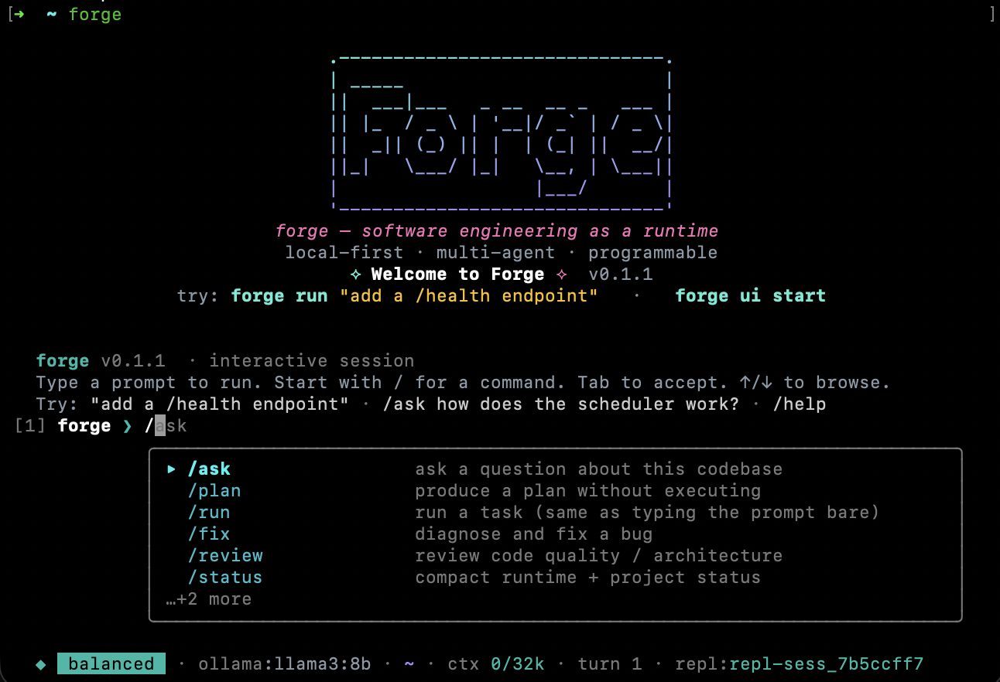
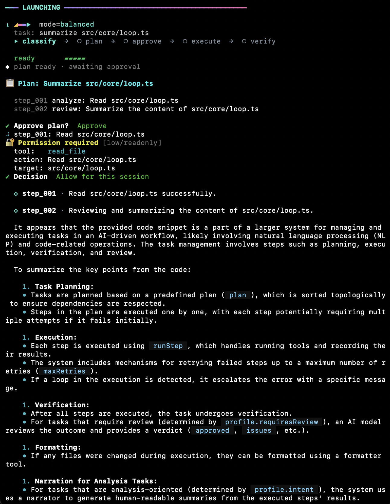
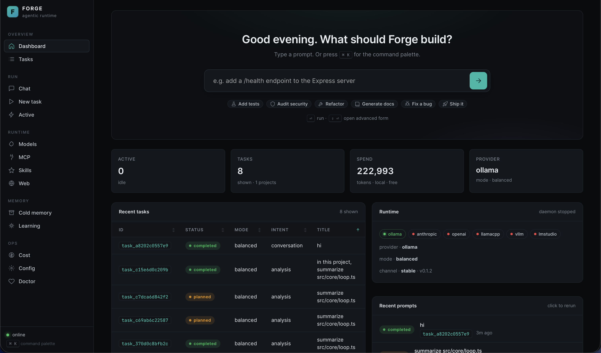

<div align="center">
  <h1>Forge demo</h1>
  
  <br>
  <em>Local-first, multi-agent, programmable software-engineering runtime.</em>
</div>

---

## What this document is

A hands-on tour of Forge's three surfaces — the **interactive REPL**, the **one-shot CLI**, and the **web dashboard** — all driving the same runtime (`src/core/orchestrator.ts`). Every screenshot below is real output; every video clip is an unedited screen capture.

Jump to:

- [Before you start](#before-you-start)
- [The REPL](#1-the-repl--forge)
- [The one-shot CLI](#2-the-one-shot-cli--forge-run-)
- [The web dashboard](#3-the-web-dashboard--forge-ui-start)
- [Common workflows](#common-workflows)
- [Tips & gotchas](#tips--gotchas)

---

## Before you start

```bash
# Install
npm install -g @hoangsonw/forge

# Health check — lists reachable providers + role→model mapping
forge doctor

# Pick a local model if you don't have one yet (free, runs on your box)
ollama pull llama3:8b          # ~4.7 GB, general-purpose
ollama pull qwen2.5:7b         # ~4.4 GB, better at code
```

If `forge doctor` shows at least one green provider, you're ready.

---

## 1. The REPL · `forge`

Interactive shell with multi-turn prompts, slash-command autocomplete, digit shortcuts for interactive prompts, streamed markdown rendering, and live file-change tracking. The REPL is the right surface when you want a **conversation** — asking follow-up questions, iterating on a plan, or exploring a codebase.

### Screenshot



### Video

https://github.com/user-attachments/assets/550c76ed-ee05-438f-a55d-5be09e2cf78f

> If your markdown viewer doesn't render the video inline, open [`images/REPL.mp4`](images/REPL.mp4) directly.

### Try it

```bash
forge
```

Then at the prompt:

```
[1] forge ❯ summarize src/core/loop.ts in this project
[2] forge ❯ what are the key state transitions it manages?
[3] forge ❯ /mode heavy
[4] forge ❯ add a small helper that counts step retries
```

Each turn threads the previous ones into the planner's context via `composeDescription` (see `src/core/conversation.ts`), so follow-ups resolve against real prior turns — not hallucinated history.

### What to look for in the demo

- **Launch banner** — mode, task, and phase breadcrumbs (`classify → plan → approve → execute → verify`) print above the progress rail.
- **Live streaming** — the model's answer reflows token-by-token with markdown formatting (headings, fenced code, lists) forming up in place.
- **Slash-command dropdown** — type `/` and the fuzzy-ranked slash catalog appears above the prompt. Arrow keys pick, Tab accepts, digit keys jump.
- **Status line** — shows mode, provider:model, cwd, context usage, turn number, conversation id, plus any active permission flags (`+files`, `+shell`, …).
- **DONE block** — duration, files changed, and a final completion line after each task.

---

## 2. The one-shot CLI · `forge run "..."`

A single task end-to-end: classify → plan → approve → execute → verify → report. Ideal for CI jobs, batch scripts, and "I know exactly what I want" invocations.

### Screenshot



### Video

https://github.com/user-attachments/assets/9e1cbbd0-764c-46b4-a937-447ef37fe31a

> If your markdown viewer doesn't render the video inline, open [`images/CLI.mp4`](images/CLI.mp4) directly.

### Try it

```bash
# A read-only analysis (no mutation risk)
forge run "summarize src/core/loop.ts"

# A bugfix with auto-approve (skip the plan-approval prompt)
forge run --yes "fix the off-by-one in pagination.ts"

# Produce a plan without executing it
forge run --plan-only "add a /health endpoint to the Express server"

# Pick a mode explicitly
forge run --mode heavy "refactor the auth middleware to use JWTs"

# Deterministic output for reproducibility (temperature 0)
forge run --deterministic "add JSDoc to every exported fn in src/types"
```

### Flags worth knowing

| Flag | Effect |
|---|---|
| `--yes` | auto-approve plan |
| `--plan-only` | produce plan, stop |
| `--mode <m>` | `fast` · `balanced` · `heavy` · `plan` · `audit` · `debug` · `architect` · `offline-safe` |
| `--strict` | confirm every action |
| `--allow-files` / `--allow-shell` / `--allow-network` / `--allow-web` / `--allow-mcp` | session-scoped permission grants |
| `--skip-permissions` | skip routine prompts (high-risk still asked) |
| `--deterministic` | temperature 0 for reproducible output |
| `--non-interactive` | deny any prompt silently (CI-safe) |
| `--trace` | emit full trace (implies `--debug`) |

See `forge run --help` for the full list.

### What to look for in the demo

- **`━━━ LAUNCHING ━━━`** banner at the start (mode, task, phase pills).
- **Plan approval prompt** with `Approve / Edit / Reject` — Edit opens `$EDITOR` with the plan JSON.
- **Per-step execution** with spinner + tool-result echoes.
- **`━━━ DONE ━━━`** banner at the end with duration, files changed, model cost (when billable).

---

## 3. The web dashboard · `forge ui start`

A local HTTP + WebSocket dashboard (vanilla JS, <120 KB, no CDN). Runs on `http://127.0.0.1:7823`. Best for watching multiple tasks, browsing history, reading long outputs, or driving Forge from a browser tab.

### Screenshot



### Video

https://github.com/user-attachments/assets/49a9e479-5be6-4cc7-ab5e-c906d0103316

> If your markdown viewer doesn't render the video inline, open [`images/UI.mp4`](images/UI.mp4) directly.

### Try it

```bash
forge ui start
# open http://127.0.0.1:7823
```

Or via Docker Compose (Forge + Ollama + UI in one command):

```bash
docker compose -f docker/docker-compose.yml up -d
```

### What you can do in the dashboard

- **Hero input on the Dashboard** — type a prompt, pick a project path (autocomplete from known projects, or hit **Browse…** for a server-side `$HOME`-scoped directory picker), fire the task.
- **Chat view** — multi-turn conversations with markdown-rendered bot replies.
- **Task detail view** — live stream of phase events, working-spinner, streamed model output, and a follow-up input that threads prior turns into the next task.
- **Tasks view** — full history, searchable; click any row to expand/continue.
- **Plan approval / Edit modal** — when a task hits approval, the plan viewer offers **Reject / Edit… / Approve & run**. Edit opens an inline JSON editor; save re-enters the approval loop with the new plan.
- **Permission modal** — per-call risk-classified prompts (`Deny / Allow once / Allow for session`).
- **Live cost + token counters** — for local providers, shows token count; for hosted (OpenAI / Anthropic), shows estimated USD.
- **Historical-task replay** — click a past task in the history table and the dashboard replays its saved plan + summary + file list even though the WebSocket subscription only streams live tasks.

### What to look for in the demo

- **Project picker** under the hero input — dropdown of known projects plus a **Browse…** button.
- **Streaming markdown** reflowing live in the task stream.
- **Plan viewer** with per-step chips (type, risk, id, target) and three-button footer.
- **Follow-up composer** at the bottom of each task view — continues the conversation by spawning a new task with composed prior-turn context.

---

## Common workflows

### Analyze a file without touching it

```bash
forge run "summarize src/core/loop.ts"
```

The classifier tags this as `intent=analysis`, so the planner is forbidden from emitting mutation steps (`edit_file`, `write_file`, `run_tests`). The narrator pass turns the gathered context into a human-readable summary.

### Iterate on a change in the REPL

```
[1] forge ❯ find everywhere we call `saveTask` without wrapping in try/catch
[2] forge ❯ wrap those with a shared helper that logs the error
[3] forge ❯ run the tests
```

Each turn's context is threaded into the next, so the model knows what the previous turns touched.

### Plan-first, approve later (CI-friendly)

```bash
forge run --plan-only "add a /health endpoint" > plan.json
# review plan.json in your PR
forge run --yes "add a /health endpoint"
```

### Drive Forge from a browser tab

```bash
forge ui start
```

Open `http://127.0.0.1:7823`, set the project path once (sticky until you change it), fire any prompt — plan approval and permissions surface as modals.

### Mix surfaces in one session

Same SQLite index, same tasks, same conversation files. Start a task in the REPL, watch it finish in the dashboard's Active view, continue the conversation from either side. Each surface is a view over the runtime, not a sandbox.

---

## Tips & gotchas

- **`forge doctor`** is your friend. If something's off — provider unreachable, keychain not available, model role unmapped — this tells you.
- **First turn is slower.** Local models cold-start; Forge emits a `MODEL_WARMING` event so you can see it.
- **`~/.forge/logs/forge.log`** is the authoritative debug log. Trace-level with `--trace` or `FORGE_LOG_LEVEL=debug`.
- **Cancel** any running task with `Ctrl+C` in the REPL, the CLI, or the dashboard's **Cancel** button.
- **Permission grants are scoped.** An "allow for session" only applies to that REPL / CLI invocation; it doesn't persist across runs unless you explicitly set it in `~/.forge/config.json`.
- **Your local model matters.** Forge's planner and narrator expect a model ≥ 7B for reasonable instruction-following; 3B chat models will produce noisy plans. `ollama pull qwen2.5:7b` is a solid default.

---

## Where to next

- [`README.md`](README.md) — full feature list, architecture, runtime metrics.
- [`docs/ARCHITECTURE.md`](docs/ARCHITECTURE.md) — hot paths, mode caps, state machine.
- [`docs/SETUP.md`](docs/SETUP.md) — contributor setup.
- [`FLYWHEEL.md`](FLYWHEEL.md) — the plan → bead → code methodology.
- [`CLAUDE.md`](CLAUDE.md) / [`AGENTS.md`](AGENTS.md) — context for AI agents working on this repo.
