<!-- Comprehensive README. Numbers sourced from docs/metrics.json; regenerate with `bash scripts/metrics.sh`. -->

<div align="center">

# Forge

**A local-first, plan-first, multi-agent, and programmable software-engineering runtime.**

*Not an assistant. A runtime.* Forge brings its own scheduler, sandbox,
permission system, state machine, agentic loop, memory layers, and
plugin ecosystem. You pick the model. You approve the actions. Everything
is inspectable, replayable, and yours.


**[Install](https://github.com/hoangsonww/Forge-Agentic-Coding-CLI/blob/master/docs/INSTALL.md) · [Dev setup](https://github.com/hoangsonww/Forge-Agentic-Coding-CLI/blob/master/docs/SETUP.md) · [Architecture](https://github.com/hoangsonww/Forge-Agentic-Coding-CLI/blob/master/docs/ARCHITECTURE.md) · [Releases & versioning](https://github.com/hoangsonww/Forge-Agentic-Coding-CLI/blob/master/RELEASES.md) · [Demo walkthrough](DEMO.md) · [Wiki Page](https://hoangsonww.github.io/Forge-Agentic-Coding-CLI/) · [NPM Package](https://www.npmjs.com/package/@hoangsonw/forge) · [License](LICENSE)**

</div>

---

## Table of contents

1. [At a glance](#at-a-glance)
2. [Why Forge](#why-forge)
3. [Quick start](#quick-start)
4. [The agentic loop (with diagrams)](#the-agentic-loop)
5. [Task state machine](#task-state-machine)
6. [Executor — iterative tool-use loop](#executor--iterative-tool-use-loop)
7. [Memory layers](#memory-layers)
8. [Provider routing & auto-adaptation](#provider-routing--auto-adaptation)
9. [Safety model](#safety-model-not-optional)
10. [Modes](#modes)
11. [CLI reference](#cli-reference)
12. [Filesystem layout](#filesystem-layout)
13. [Skills · Instructions · MCP](#skills--instructions--mcp)
14. [Run in a container](#run-in-a-container-docker-or-podman)
15. [CI/CD pipeline](#cicd-pipeline)
16. [Architecture map](#architecture-map)
17. [Development](#development)
18. [License](#license)

---

## At a glance

Forge is a local-first, plan-first, multi-agent, and programmable software-engineering runtime. Unlike Claude Code or OpenAI Codex, Forge is local-first infrastructure, not a hosted assistant. It brings its own scheduler, sandbox, permission system, state machine, agentic loop, memory layers, and plugin ecosystem. You pick & host the model. You approve the actions. Everything is inspectable, replayable, and yours.

<div align="center">

|                                         | value                                                 | reproducer                                                                          |
|-----------------------------------------|-------------------------------------------------------|-------------------------------------------------------------------------------------|
| ⚡ **`forge doctor` cold-start**         | **173 ms**                                            | `time node bin/forge.js doctor --no-banner`                                         |
| ⚡ **`forge --help` cold-start**         | **238 ms**                                            | `time node bin/forge.js --help`                                                     |
| 📦 **UI shell · zero CDN**              | **90 KB** uncompressed                                | `wc -c src/ui/public/app.js`                                                        |
| 🌐 **Provider probe timeout**           | **1.5 s**                                             | `src/models/openai.ts#isAvailable`                                                  |
| 🔌 **Model providers** (auto-detected)  | **6**                                                 | ollama · lmstudio · vllm · llama.cpp · openai-compat · anthropic                    |
| 🧠 **Model families** classified        | **41**                                                | Llama / Qwen / DeepSeek / Gemma / Phi / Mistral / Codestral / …                     |
| 🤖 **Built-in agents**                  | **6**                                                 | planner · architect · executor · reviewer · debugger · memory                       |
| 🛠 **Tools** available to agents        | **18**                                                | read · write · edit · grep · glob · run_command · git · web · …                     |
| 💬 **CLI subcommands · slash commands** | **24 · 55**                                           | `forge --help` · `/help` in REPL                                                    |
| 🎛 **Modes**                            | **9**                                                 | fast · balanced · heavy · plan · execute · audit · debug · architect · offline-safe |
| ✅ **Tests**                             | **548 / 97 files** · 100% passing · ~5.5 s wall-clock | `npx vitest run`                                                                    |
| 🐳 **CI jobs · release stages**         | **9 · 6**                                             | [`.github/workflows/`](.github/workflows)                                           |
| 📦 **Container image**                  | ~355 MB · multi-arch · non-root · HEALTHCHECK         | `docker pull ghcr.io/hoangsonw/forge-agentic-coding-cli:latest`                     |

</div>

**Tech Stack:**


---

## Why Forge

Most "AI coding tools" are thin chat wrappers over a cloud API. Forge is
**engineering infrastructure** with first-class:

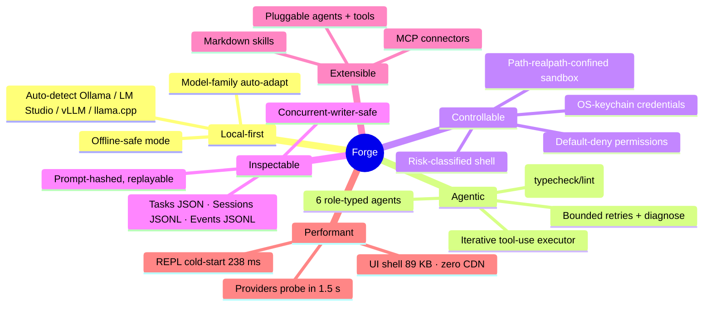

- **Local-first.** Forge auto-detects Ollama, LM Studio, vLLM, and
  llama.cpp on their default ports. Cloud (Anthropic / OpenAI / LocalAI /
  Together / Groq / Azure) is opt-in, not required.
- **Agentic but controllable.** Every action is classified (risk ×
  side-effect × sensitivity), gated by a permission system, and logged
  with a reproducible prompt hash.
- **Inspectable.** Sessions JSONL, tasks JSON, events JSONL. Two processes
  can edit the same conversation concurrently (POSIX `O_APPEND` +
  `mkdir` lockfile).
- **Mode-driven.** 9 explicit modes — each carries **enforceable**
  budgets (max executor turns, max validation retries, allowMutations,
  maxAutoRisk).
- **Extensible.** Drop a Markdown file in `~/.forge/skills/`. Add an
  `Agent`. Wire an MCP connector. No rebuild required.
- **Performant.** `forge doctor` cold-starts in 173 ms. The UI shell is a
  single 89 KB JavaScript file with zero CDN dependencies. Providers are
  probed in parallel with a 1.5 s timeout.
- **Open source.** MIT license. No telemetry, no phoning home, no hidden
  backdoors. You get the whole stack. Unlike hosted assistants, Forge is fully inspectable, replayable, and yours.

> [!TIP]
> Unlike Claude Code or OpenAI Codex, Forge is not a hosted assistant. It's local-first infrastructure. You pick & host the model. You approve the actions. Everything is inspectable, replayable, and yours.

---

## Quick start

```bash
# Option 1 — npm (global):
npm install -g @hoangsonw/forge
forge doctor             # green checks + role→model mapping
forge run "explain this repo"

# Option 2 — Docker:
docker run --rm -it \
  -v forge-home:/data -v "$PWD:/workspace" \
  ghcr.io/hoangsonw/forge-agentic-coding-cli:latest forge run "explain this repo"

# Option 3 — full stack (forge + ollama + dashboard):
docker compose -f docker/docker-compose.yml up -d
# open http://127.0.0.1:7823
```

### System requirements

| | Minimum | Notes |
|---|---|---|
| **Node.js** | **≥ 20** (22 tested) | Enforced via `package.json#engines`. Not needed if you use Docker. |
| **OS** | macOS · Linux · Windows (WSL recommended) | `better-sqlite3` ships prebuilds for darwin-x64, darwin-arm64, linux-x64, linux-arm64, win32-x64 — no compile step. |
| **Disk** | ~150 MB for `node_modules`; state under `~/.forge` grows with history | Override via `FORGE_HOME`. |
| **RAM** | Forge ~100 MB; your local model consumes its own RAM/VRAM | `forge doctor` cold-starts in ~170 ms. |
| **Docker** (alt path) | ≥ 25 | Multi-arch (amd64, arm64) image on GHCR. Zero host Node needed. |
| **At least one model source** | Ollama · LM Studio · vLLM · llama.cpp · Anthropic · OpenAI-compatible | `forge doctor` tells you which are reachable. |

**Runtime npm dependencies** (13, zero optional): `@modelcontextprotocol/sdk`, `better-sqlite3` (native, prebuilt), `chalk`, `cli-table3`, `commander`, `dotenv`, `ora`, `prompts`, `semver`, `undici`, `ws`, `yaml`, `zod`. No Python, Rust, or Go toolchain.

**Recommended** (not required): `ripgrep` (fast `grep` tool path), `git` (diff/status tools + project-root detection), `$EDITOR` (used when you pick "Edit" on a plan).

See [`docs/INSTALL.md`](docs/INSTALL.md) for per-OS notes and [`docs/SETUP.md`](docs/SETUP.md) for contributor setup.

### See it running

Three surfaces, one runtime.

**REPL (Interactive Terminal) Mode**

https://github.com/user-attachments/assets/eb592bbf-62a1-4d74-a540-7e066ebe56a4

**CLI (Headless, One-shot run) Mode**

https://github.com/user-attachments/assets/bc3b3204-fd87-436f-9467-604535edb4e2

**Web UI Dashboard**

https://github.com/user-attachments/assets/218cd64f-40fe-4836-9c62-c7a08538056b

---

## The agentic loop

Every non-trivial task flows through the same pipeline. Nothing escapes
it — no hidden shortcut, no "just this once" bypass.

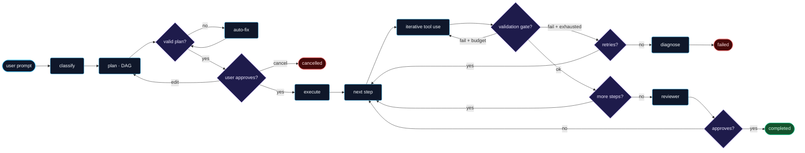

Source: [`src/core/loop.ts`](src/core/loop.ts). Retry cap is 3, then the
debugger agent diagnoses before the task is marked `failed`.

### A concrete run

```
forge run "fix the failing login test" --mode heavy
  → classified:   bugfix · complexity=moderate · risk=low
  → plan:         4 steps  (analyze → locate → patch → run_tests)
  → approve?      [y/n/edit]
  → executor:     turn 1 — read_file src/auth/login.ts
                  turn 2 — grep "issuedAt" in src
                  turn 3 — apply_patch src/auth/login.ts
                  turn 4 — run_command "npm test -- auth.login"
  → validate:     typecheck ✓   lint ✓
  → reviewer:     approved
  → ✔ Done. Files changed: src/auth/login.ts
```

---

## Task state machine

Every task lives in exactly one of **10 statuses**. Transitions are
enforced by `LEGAL_TRANSITIONS` — illegal moves throw `state_invalid`
with the legal-next list in `recoveryHint`.

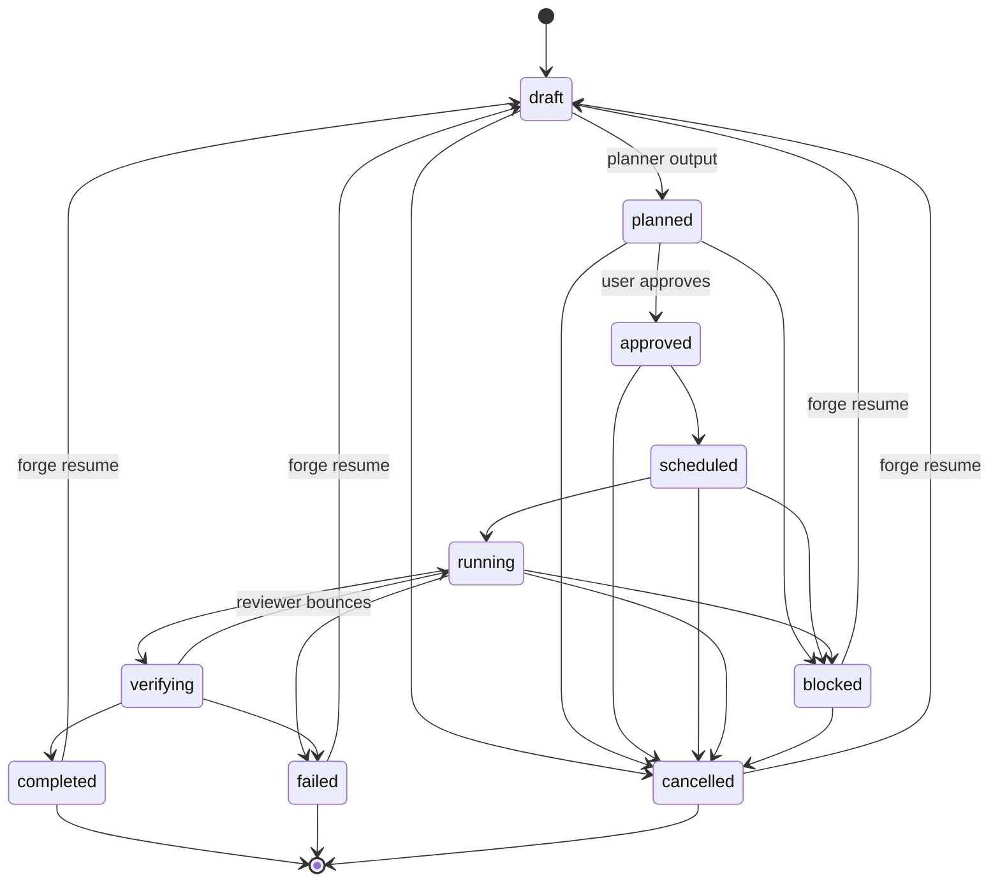

Source: [`src/persistence/tasks.ts#LEGAL_TRANSITIONS`](src/persistence/tasks.ts).

---

## Executor — iterative tool-use loop

Each plan step runs a **bounded model↔tool conversation**, not a one-shot
call. The model sees every tool result and can adapt within the same
step — retry with different args, switch tools, or signal done.

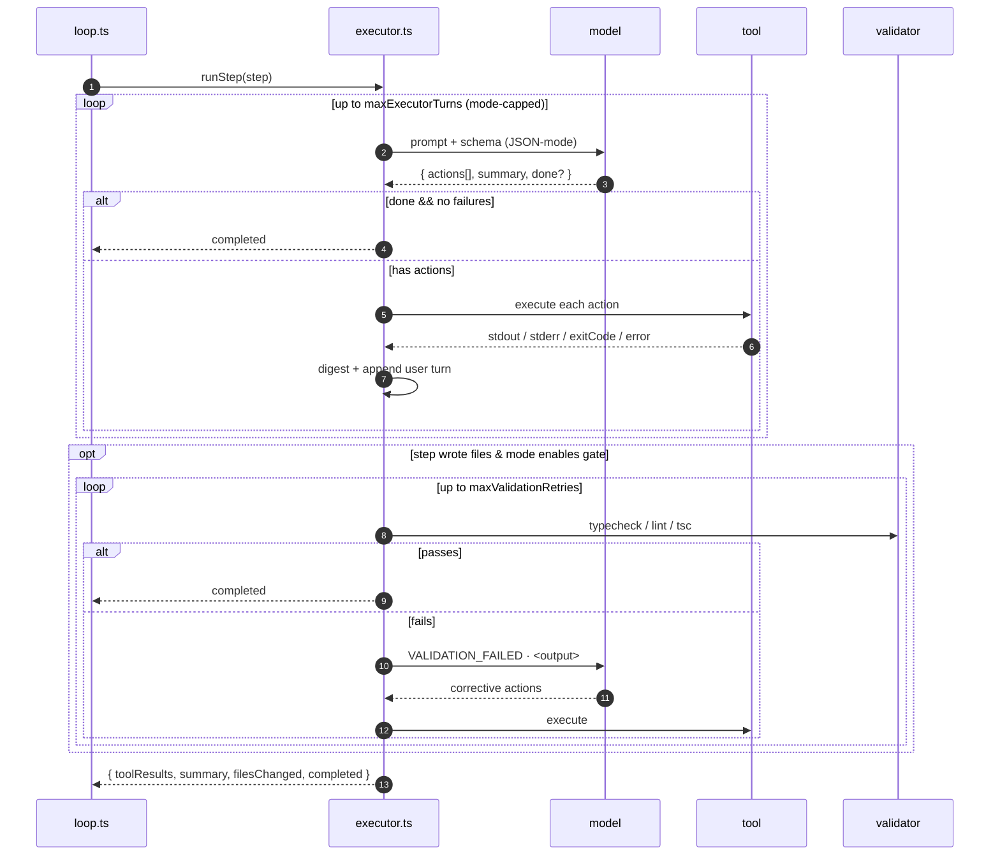

Mode caps — read directly from [`src/core/mode-policy.ts`](src/core/mode-policy.ts):

| Mode | maxExecutorTurns | maxValidationRetries | allowMutations | maxAutoRisk |
|------|:---:|:---:|:---:|:---:|
| fast | 2 | 0 | ✅ | low |
| balanced | 4 | 1 | ✅ | medium |
| heavy | 8 | 2 | ✅ | high |
| plan | 0→1 | 0 | ❌ | low |
| execute | 4 | 1 | ✅ | medium |
| audit | 3 | 0 | ❌ | low |
| debug | 6 | 2 | ✅ | medium |
| architect | 3 | 1 | ✅ | medium |
| offline-safe | 3 | 1 | ✅ | medium |

---

## Memory layers

Four tiers with distinct retention and access cost:

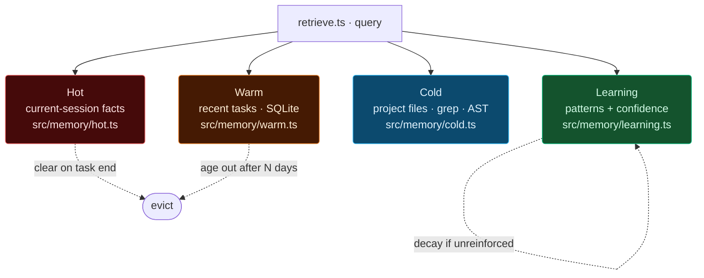

- **Hot** — in-process per-task facts, cleared at task end.
- **Warm** — SQLite index of recent task metadata; powers "what was I
  doing yesterday" queries.
- **Cold** — lazy file/grep/AST index scoped to `projectRoot`. No
  background indexer; populated on demand.
- **Learning** — patterns keyed by `intent:scope` with confidence that
  evolves on success/failure. **The planner reads the top-K patterns
  before producing every plan** (see `src/agents/planner.ts#learnedPatternBlock`).

---

## Provider routing & auto-adaptation

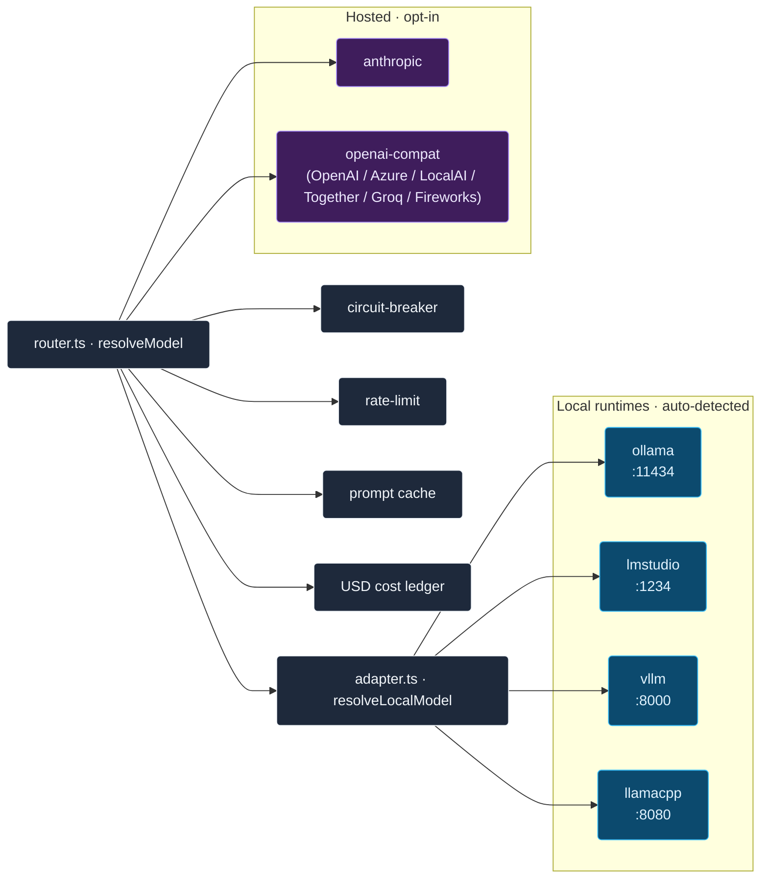

### Auto-adaptation

If your configured model isn't pulled on the provider, Forge **picks the
best-fit installed model for each role** via
[`src/models/local-catalog.ts`](src/models/local-catalog.ts) +
[`src/models/adapter.ts`](src/models/adapter.ts). Cached per process,
warns once, never refuses to route.

### Supported runtimes

| Runtime | Default endpoint | Override |
|---------|------------------|----------|
| Ollama | `http://127.0.0.1:11434` | `OLLAMA_ENDPOINT` |
| LM Studio | `http://127.0.0.1:1234/v1` | `LMSTUDIO_ENDPOINT` |
| vLLM | `http://127.0.0.1:8000/v1` | `VLLM_ENDPOINT` |
| llama.cpp server | `http://127.0.0.1:8080/v1` | `LLAMACPP_ENDPOINT` |
| OpenAI-compatible | env-configured | `OPENAI_BASE_URL` + `OPENAI_API_KEY` |
| Anthropic | hosted | `ANTHROPIC_API_KEY` |

### Model family classification (41 families)

| Role | Families preferred |
|------|--------------------|
| architect / reviewer / debugger | Llama 3.x / 4.x, Mixtral, Command-R+, DeepSeek V3/R1, Mistral-Large |
| planner | Qwen 2.5/3, Llama 3.x, DeepSeek V3, Gemma 3, Mistral-Nemo, Command-R, Phi 4 |
| executor (code specialists) | DeepSeek-Coder, Qwen 2.5-Coder, CodeLlama, Codestral, StarCoder, Granite-Code, WizardCoder |
| fast | Phi 3/4, Gemma 2, TinyLlama, SmolLM, MiniCPM |

Unknown models are accepted too — Forge rates them as generic executors
rather than refusing to route.

### Model size & capability notes

The agentic loop is cheap for the runtime but expensive for the *model*.
Every step is a multi-turn tool-use conversation that returns strict JSON.
Small models struggle with this in recognisable ways — please pick the
right tool for the job.

| Work you want to do | Safe local floor | What fails below the floor |
|---|---|---|
| Pure chat ("explain closures") | any 3B instruct (phi-3:mini, gemma-3:2b) | fine — conversation fast-path bypasses tool use entirely |
| Summarize a file, explain a snippet | 7B instruct (qwen2.5:7b, llama3.1:8b) | summary is a line of "I read the file" instead of content |
| Single-file edits / small features | **7B+ code specialist** (deepseek-coder:6.7b, qwen2.5-coder:7b) | picks wrong tool (run_command to write files), splits "create empty + edit" patterns, escalates to ask_user on tool errors |
| Multi-file refactors, new features | 14B+ code specialist or a hosted frontier model | plan quality drops; step IDs get inconsistent; validation retries exhausted |
| Architecture-level changes | hosted (Claude Opus/Sonnet, GPT-4 class) realistically | budgets blow out; changes go off-plan |

Forge ships with defences so a small model fails *loudly* instead of
silently corrupting files: the executor prompt spells out step-type →
tool mappings, `ask_user` rejects empty/too-short questions as
non-retryable, `edit_file` handles "create empty then fill" gracefully,
parent directories auto-create, provider warm-up is explicit, and the
router streams prose without `jsonMode` for narrator/conversation
paths. The result is that a small model will often tell you it can't
finish a task; it will rarely write the wrong code into a file.

If in doubt: configure a code specialist for the `code` role, keep
something lighter for `fast`, and set `ANTHROPIC_API_KEY` or
`OPENAI_API_KEY` as a fallback — the router uses the hosted provider
automatically when the local one fails or trips its circuit breaker.

```bash
forge config set models.code    deepseek-coder:6.7b
forge config set models.planner qwen2.5:7b
forge config set models.fast    phi3:mini
export ANTHROPIC_API_KEY=sk-…   # optional fallback
```

---

## Safety model (not optional)

Forge treats safety as load-bearing. These invariants are enforced in
code, not convention:

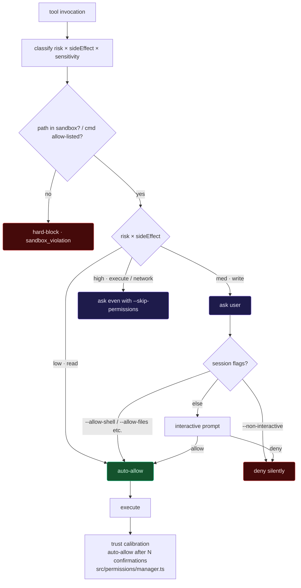

| Invariant | Where |
|---|---|
| Instruction precedence: `System Safety > Page Rules > Mode Rules > Approved Plan > Project Defaults > User Preferences` | `src/prompts/assembler.ts` |
| Permission model = default deny | `src/permissions/manager.ts` |
| `--skip-permissions` skips *routine* prompts only; critical/destructive still ask | `src/permissions/risk.ts` |
| Retry cap = 3, then debugger escalates | `src/core/loop.ts` |
| Hard limits: `maxSteps=50` · `maxToolCalls=100` · `maxRuntimeSeconds=600` | `src/config/schema.ts` |
| Untrusted content (web / MCP / retrieved) fenced as data, never instructions | `src/security/injection.ts` |
| Secrets redacted before every log, session entry, and prompt | `src/security/redact.ts` |
| Scoped filesystem sandbox; symlink-escape-proof via realpath | `src/sandbox/fs.ts` |
| Destructive shell commands blocked (`rm -rf /`, `sudo`, fork bombs, curl-to-shell) | `src/sandbox/shell.ts` |
| Credentials in OS keychain (macOS / libsecret / DPAPI) + AES-GCM fallback | `src/keychain/` |
| Release artefacts: SHA-256 + Ed25519 signature verification | `src/release/` |

---

## Modes

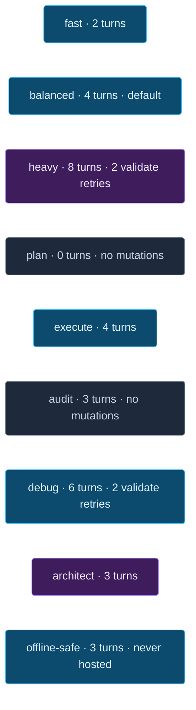

Each mode is an **enforceable budget** — not a hint to the model. See
[`src/core/mode-policy.ts`](src/core/mode-policy.ts).

---

## CLI reference

> **▶ See each surface in action** in [DEMO.md](DEMO.md) — REPL walkthrough, `forge run` one-shots, and the web dashboard.

24 subcommands. Full surface:

```
forge                          # REPL (default)
forge init                     # create ~/.forge + project .forge
forge run "<prompt>"           # full agentic loop
forge plan "<prompt>"          # plan-only
forge execute "<prompt>"       # auto-approve + execute
forge resume [taskId]          # resume any prior task (any status)
forge status                   # runtime state
forge doctor                   # health check + role→model mapping
forge task list|search|delete  # task history (SQLite-indexed); delete prompts (or -y)
forge session list|replay <id> # session JSONL inspection
forge model list               # probe all providers
forge config get|set|path      # configuration
forge mcp list|add|remove      # MCP connections
forge skills list|new          # skill management
forge agents list              # custom agents
forge permissions reset|list   # permission grants
forge daemon start|stop|status # optional background process
forge memory {hot|warm|cold}   # memory inspection
forge cost                     # USD spend ledger
forge ui start                 # local dashboard at :7823
forge bundle {pack|unpack}     # offline bundles
forge container up|down        # compose wrapper
forge update [--check|--force] # self-update (REPL also checks on start, cache-gated)
forge migrate                  # DB migrations
forge changelog                # local changelog view
forge dev                      # dev helpers
forge web {search|fetch}       # web tools
forge spec {new|show|diff}     # spec-driven development
```

### Common flags (`run` / `plan` / `execute`)

```
--mode <m>             fast|balanced|heavy|plan|execute|audit|debug|architect|offline-safe
--yes                  auto-approve plan
--skip-permissions     skip routine prompts (high-risk still asked)
--allow-files          pre-approve file writes for this session
--allow-shell          pre-approve shell for this session
--allow-network        pre-approve network tools
--allow-web            pre-approve web search/fetch/browse
--allow-mcp            pre-approve MCP tool calls
--strict               confirm every action
--non-interactive      deny all prompts silently (CI mode)
--deterministic        fixed temperatures for reproducibility
--trace                full trace (implies --debug)
--no-banner            omit startup banner
```

---

## Filesystem layout

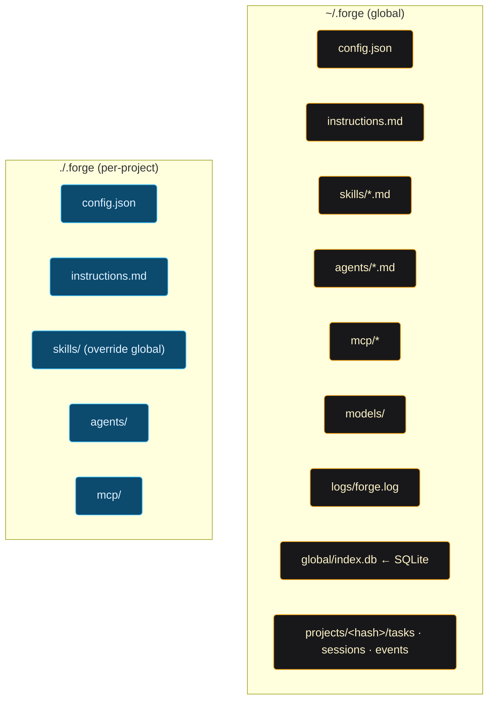

Paths resolved via [`src/config/xdg.ts`](src/config/xdg.ts) — respects
`XDG_*` env vars on Linux.

---

## Skills · Instructions · MCP

### Skills — a Markdown file with YAML frontmatter

```markdown
---
name: conventional-commit
description: Enforce Conventional Commits in every commit message.
triggers: [commit, git]
---
When writing commit messages, use Conventional Commits:
  feat(scope): …
  fix(scope): …
  refactor(scope): …
```

Drop into `~/.forge/skills/` (global) or `./.forge/skills/` (project).
Project skills override global.

### Instructions

Both `~/.forge/instructions.md` and `./.forge/instructions.md` are
layered into every prompt via [`src/prompts/assembler.ts`](src/prompts/assembler.ts).
Precedence is: **System Safety > Page > Mode > Plan > Project > User**.

### MCP connections

```bash
forge mcp list
forge mcp add <name> --transport stdio --command "…"
forge mcp add <name> --transport http --url https://… --auth oauth2-pkce
forge mcp status
```

Both `stdio` and HTTP-stream transports supported. OAuth 2.0 + PKCE or
API key auth. Tokens stored in the OS keychain.

---

## Run in a container (Docker or Podman)

Single hardened image (non-root, HEALTHCHECK, OCI labels, ~355 MB) that
serves both CLI and UI.

> [▶ Dashboard demo](images/UI.mp4) — `forge ui start` driving a full task end-to-end (plan approval, streamed model output, follow-up thread). More in [DEMO.md](DEMO.md).

```bash
# Pull (multi-arch: linux/amd64 + linux/arm64):
docker pull ghcr.io/hoangsonw/forge-agentic-coding-cli:latest

# One-shot CLI:
docker run --rm -it -v forge-home:/data -v "$PWD:/workspace" \
  ghcr.io/hoangsonw/forge-agentic-coding-cli:latest forge run "explain this repo"

# Dashboard:
docker run --rm -p 7823:7823 -v forge-home:/data \
  ghcr.io/hoangsonw/forge-agentic-coding-cli:latest forge ui start --bind 0.0.0.0

# Full stack (forge + ollama + UI):
docker compose -f docker/docker-compose.yml up -d
# or: podman-compose -f docker/docker-compose.yml up -d
```

Stack topology:

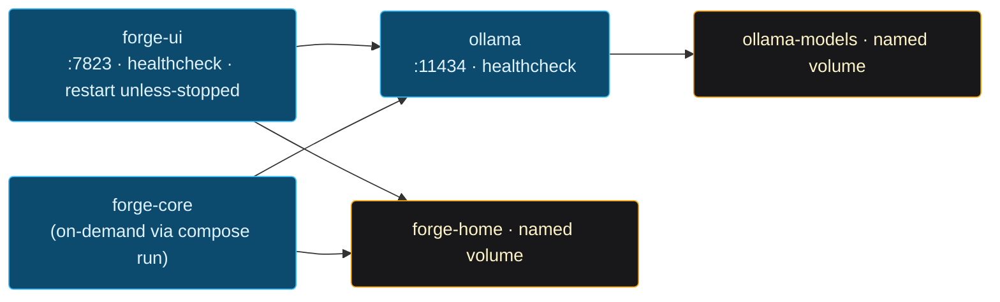

Full install guide: [`docs/INSTALL.md`](docs/INSTALL.md).

---

## CI/CD pipeline

### CI (every PR + push)

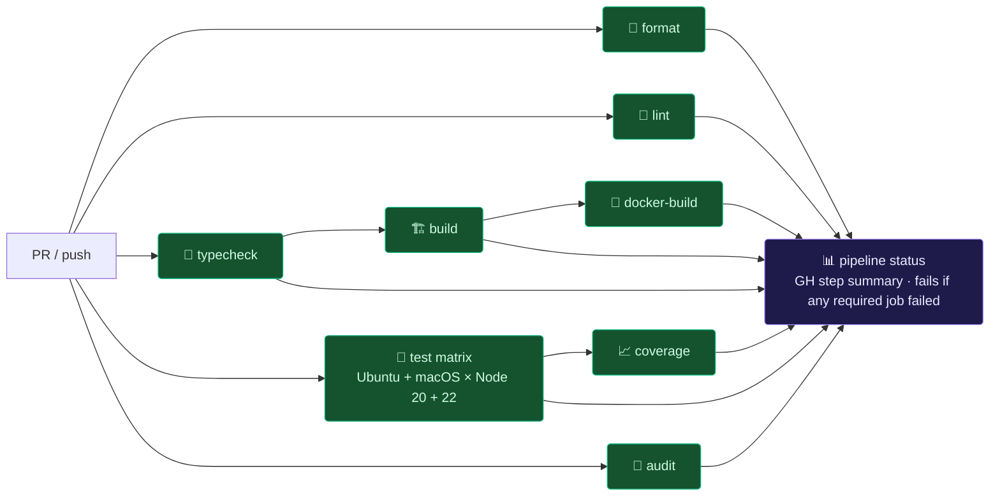

### Release (on `v*` tag)

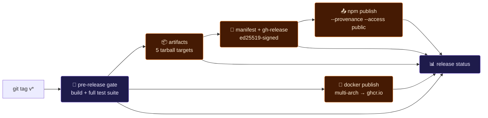

Workflows: [`.github/workflows/ci.yml`](.github/workflows/ci.yml),
[`.github/workflows/release.yml`](.github/workflows/release.yml),
[`.github/workflows/nightly.yml`](.github/workflows/nightly.yml).

Full versioning & release playbook (SemVer policy, channels, signing,
hotfix flow, rollback, built-in updater): **[`RELEASES.md`](RELEASES.md)**.

---

## Architecture map

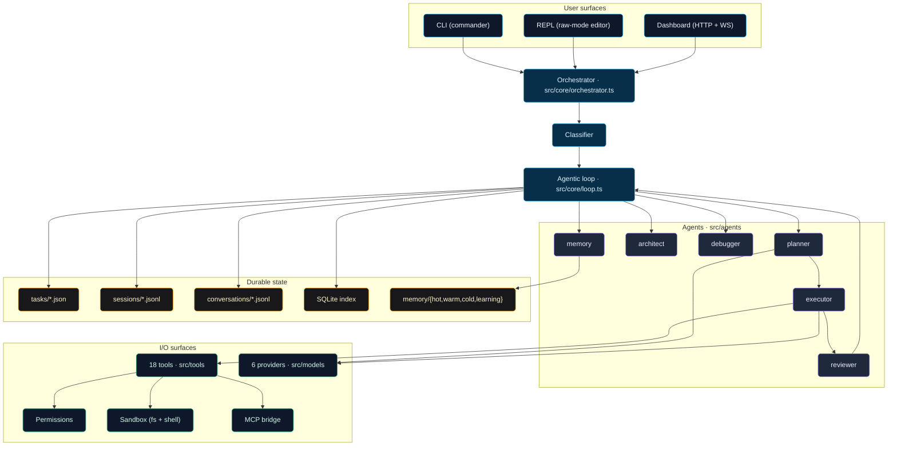

Full map with every subsystem explained: [`docs/ARCHITECTURE.md`](docs/ARCHITECTURE.md).

### Executor turn budget per mode

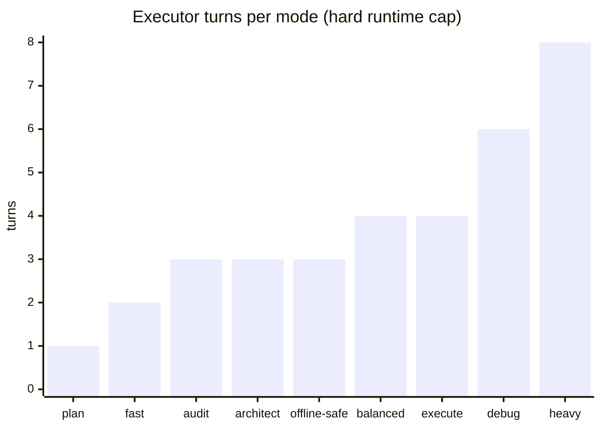

---

## Development

```bash
git clone https://github.com/hoangsonww/Forge-Agentic-Coding-CLI && cd forge
npm install
npm run build             # tsc + copy-assets
npm test                  # 548 tests across 97 files; all must pass
./bin/forge.js doctor
```

| Task | Command |
|------|---------|
| Build | `npm run build` |
| Watch | `npm run build:watch` |
| Tests | `npm test` |
| One test file | `npx vitest run test/unit/<file>.test.ts` |
| Coverage | `npm run test:coverage` |
| Typecheck | `npm run typecheck` |
| Lint / format | `npm run lint` · `npm run format` · `npm run format:check` |
| Metrics | `bash scripts/metrics.sh` |
| Docker | `docker build -f docker/Dockerfile -t forge/core:dev .` |
| REPL | `./bin/forge.js` |
| Dashboard | `./bin/forge.js ui start` |

Full guide: [`docs/SETUP.md`](docs/SETUP.md).

### Measured performance (reproduce with the commands shown)

| Target | Measured | How |
|--------|----------|-----|
| `forge --help` cold-start | **238 ms** | `time node bin/forge.js --help` |
| `forge doctor` cold-start | **173 ms** | `time node bin/forge.js doctor --no-banner` |
| UI `app.js` uncompressed | **89 KB** | `wc -c src/ui/public/app.js` |
| Landing `index.html` | **25 KB**, self-contained, zero CDN | `wc -c index.html` |
| Full test suite | **~3.3 s** wall-clock | `npx vitest run` |
| Container image | **~355 MB** multi-arch non-root | `docker images` |

---

## Agent-facing context

If you're a code-writing agent (Claude Code, Codex, Cursor, Aider, Cline,
Continue, …) working in this repo, start here:

- [`CLAUDE.md`](CLAUDE.md) — Claude Code / Claude-family context
- [`AGENTS.md`](AGENTS.md) — OpenAI `AGENTS.md` convention (used by Codex and most others)

Both files carry: canonical commands, hot paths, conventions, performance
posture, security posture, and pre-completion checklist.

---

## License

MIT. See [LICENSE](LICENSE) for more details.

---

<div align="center" style="margin-top: 2em">
<p>Son Nguyen · <a href="https://sonnguyenhoang.com">sonnguyenhoang.com</a> · <a href="https://github.com/hoangsonww">github.com/hoangsonww</a></p>
<p>Thank you for checking out Forge! If you have any questions, feedback, or want to contribute, please open an issue or a pull request.</p>
</div>
