<!-- RELEASES.md — versioning + release guide for Forge.
     Audience: maintainers cutting releases and users consuming them.
     Numbers and workflows here must match .github/workflows/*.yml
     and src/release/*. If you change versioning policy, update this
     file in the same PR. -->

# Releases & Versioning

**How Forge versions, tags, builds, signs, and ships.**

Who this is for:
- **Users** installing, upgrading, pinning, or rolling back.
- **Maintainers** cutting a release or shipping a hotfix.
- **Integrators** consuming Forge from CI, Docker, or the npm registry.

---

## Table of contents

1. [TL;DR](#tldr)
2. [Versioning policy (SemVer)](#versioning-policy-semver)
3. [Release channels](#release-channels)
4. [Distribution surfaces](#distribution-surfaces)
5. [The release pipeline end-to-end](#the-release-pipeline-end-to-end)
6. [Cutting a release — maintainer playbook](#cutting-a-release--maintainer-playbook)
7. [Hotfix flow](#hotfix-flow)
8. [Upgrading — user playbook](#upgrading--user-playbook)
9. [Pinning & rollback](#pinning--rollback)
10. [Artifact verification (SHA-256 + Ed25519)](#artifact-verification-sha-256--ed25519)
11. [The built-in updater](#the-built-in-updater)
12. [Deprecation policy](#deprecation-policy)
13. [Emergency procedures](#emergency-procedures)
14. [FAQ](#faq)

---

## TL;DR

- **SemVer**. `MAJOR.MINOR.PATCH`. Breaking change → MAJOR. New feature → MINOR. Bugfix → PATCH.
- **Three channels**: `stable` (npm `latest`), `beta` (npm `beta`), `nightly` (npm `nightly`, cut daily at 05:00 UTC).
- **Tag → release**. Push a `vX.Y.Z` git tag; the release workflow does the rest: gate → build artifacts × 5 platforms → push multi-arch Docker image → sign manifest → publish to npm with provenance → GitHub Release.
- **Users** get updates via `npm i -g @hoangsonw/forge@latest`, `forge update apply`, or `docker pull ghcr.io/hoangsonw/forge-agentic-coding-cli:latest`.
- **Every artifact is verified**: SHA-256 against a signed manifest, Ed25519 signature against a rotating key set baked into the binary.

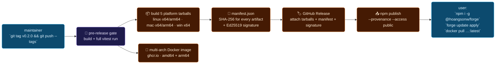

---

## Versioning policy (SemVer)

Forge follows [Semantic Versioning 2.0.0](https://semver.org). Given a version `MAJOR.MINOR.PATCH`:

| Bump | When | Examples |
|---|---|---|
| **MAJOR** | Breaking change to a public surface | CLI flag removed · tool schema rename · config-file shape change · on-disk SQLite schema that can't be migrated · permission prompt contract change |
| **MINOR** | New feature, backwards-compatible | New tool · new provider · new CLI command · additive config field · new mode |
| **PATCH** | Bugfix or non-behavioral change | Typo in prompt · docs fix · CI-only change · perf win that doesn't change behavior · dependency patch bump |

**Pre-1.0 caveat.** While Forge is `< 1.0.0`, the MINOR slot may carry breaking changes when the risk-adjusted alternative (a stream of MAJOR bumps every few weeks) would be user-hostile. Anything breaking is called out in the release notes under a **Breaking** heading. Post-1.0, SemVer is strict.

### What counts as a public surface?

| In scope (version-gated) | Out of scope (can change any release) |
|---|---|
| `forge` CLI subcommands and flags | Internal module layout under `src/` |
| Tool schemas advertised to models | Dev-only scripts under `scripts/` |
| Configuration file shape (`~/.forge/config.json`) | Internal logging formats (redacted or not) |
| Permission prompt taxonomy | Test fixtures and names |
| SQLite schema (migrations must cover every bump) | `.claude/` subagents and skills |
| HTTP+WS API surfaced by `forge ui start` | Internal graph traversal heuristics |
| Persistent event types written to JSONL | Debug log field names |

### The decision tree

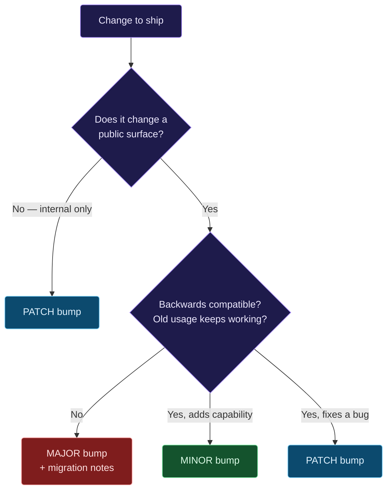

---

## Release channels

Three parallel release trains, each mapped to an npm dist-tag and a Docker tag family:

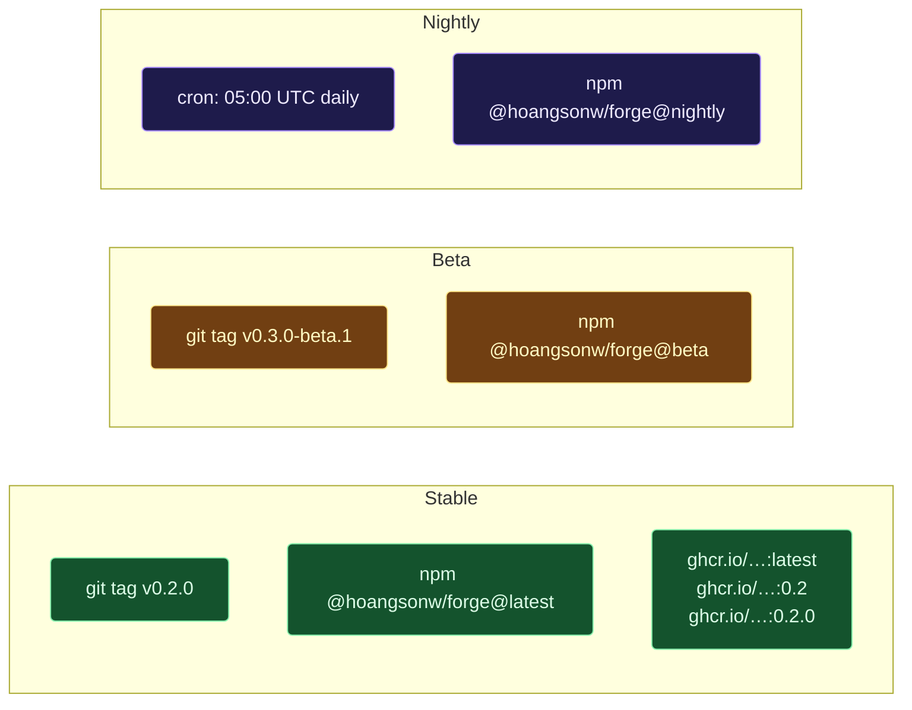

| Channel | Cadence | Audience | Install | Signed | Docker tag |
|---|---|---|---|---|---|
| **stable** | On demand (feature-complete) | Everyone | `npm i -g @hoangsonw/forge@latest` | ✅ | `:latest`, `:X.Y.Z`, `:X.Y`, `:X` |
| **beta** | Opt-in pre-release | Early adopters willing to file bugs | `npm i -g @hoangsonw/forge@beta` | ✅ | (none; npm only) |
| **nightly** | Daily at 05:00 UTC | CI / integration partners / contributors | `npm i -g @hoangsonw/forge@nightly` | ✅ | (none; npm only) |

Nightly versions look like `0.2.0-nightly.20260420`. Beta versions look like `0.3.0-beta.1`. Neither is ever tagged `latest`.

---

## Distribution surfaces

Forge is published in four places. All four come out of the **same** signed build; users pick whichever is easiest for their environment.

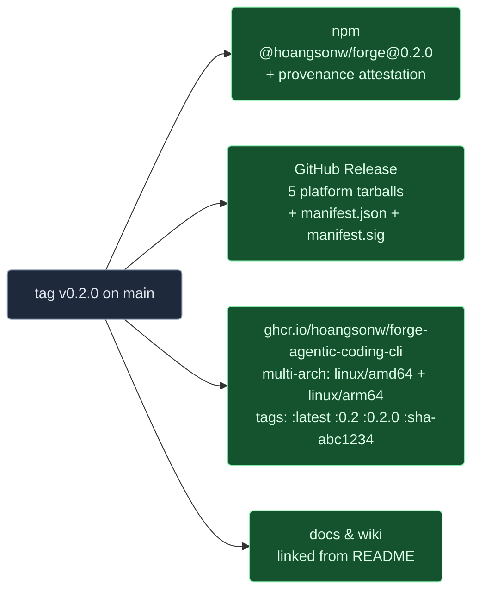

| Surface | Format | Who should use it |
|---|---|---|
| **npm** | `@hoangsonw/forge` package, CJS, with `bin/forge.js` shim | Everyone with Node 20+. Easiest install. |
| **GitHub Release** | Per-platform tarballs + signed manifest | Users who want offline / air-gapped install or automated verification |
| **GHCR Docker image** | Multi-arch OCI image with non-root user + `HEALTHCHECK` | Running Forge in containers, CI, or ephemeral sandboxes |
| **Source** | `git clone` + `npm install` | Contributors. Not a supported install channel for users. |

---

## The release pipeline end-to-end

The actual DAG of GitHub Actions jobs defined in [`.github/workflows/release.yml`](.github/workflows/release.yml):

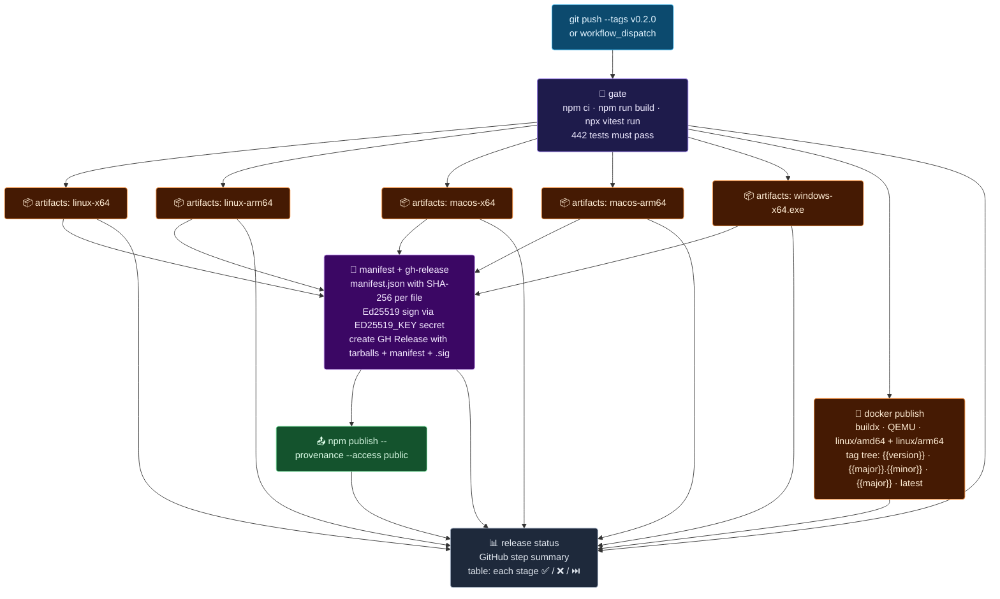

**What each stage actually does** (cross-reference to [`src/release/`](src/release/) and the workflow):

| Stage | File / job | What it guarantees |
|---|---|---|
| **Pre-release gate** | `release.yml:gate` | No release ships with red tests. `npx vitest run` is the same command users get with `npm test`. |
| **Platform artifacts** | `release.yml:build-artifacts` | One `.tgz` per `(os, arch)` pair. Built from `npm pack` on a matching runner so native deps like `better-sqlite3` resolve correctly. |
| **Docker publish** | `release.yml:docker` | `docker/Dockerfile` multi-stage build, pushed to GHCR with the full tag tree via `docker/metadata-action`. Build cache re-used across releases. |
| **Manifest + GH Release** | `release.yml:manifest` | `manifest.json` with `{ version, channel, releasedAt, artifacts: [{ name, sha256, size }] }`. Signed with the Ed25519 private key stored in `secrets.FORGE_RELEASE_ED25519_PRIV`. Release is created with the tarballs, manifest, and base64 signature attached. |
| **npm publish** | `release.yml:publish-npm` | `npm publish --provenance` — the npm provenance attestation links the published tarball to the GitHub Actions run that produced it. |
| **Release status** | `release.yml:release-status` | Summary table in the workflow run so maintainers can see at a glance which stages passed. |

---

## Cutting a release — maintainer playbook

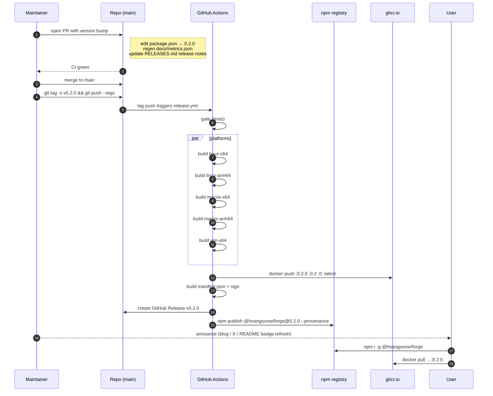

### Pre-flight checklist

Do all of these **on a PR into `main`**, before the tag:

- [ ] Bump `version` in `package.json` following [SemVer](#versioning-policy-semver).
- [ ] Run `bash scripts/metrics.sh` to regenerate `docs/metrics.json` and surface the refreshed numbers in `README.md` / `docs/ARCHITECTURE.md`.
- [ ] Update the **Release notes** section at the bottom of this file (`RELEASES.md`). Use the structure in [Release-notes template](#release-notes-template).
- [ ] `npm run format && npm run lint && npm run build && npm test` — all green locally.
- [ ] `npm run test:coverage` — coverage did not regress vs the prior release.
- [ ] If this release adds or changes a hot path (`src/core/loop.ts`, `src/agents/executor.ts`, `src/core/validation.ts`): update the corresponding section in `docs/ARCHITECTURE.md` in the **same PR**.
- [ ] If this release changes a permission prompt, a tool schema, or a CLI flag: call it out under a **Breaking** or **Behavioral** heading in the notes.

### Shipping the tag

```bash
# 1. Pull merged main, confirm version bump landed.
git checkout main && git pull --ff-only

# 2. Verify you're signing tags (recommended).
git config --get user.signingkey   # must be set
git config --get tag.gpgSign       # should be 'true'

# 3. Create and push the tag.
git tag -s v0.2.0 -m "v0.2.0"
git push origin v0.2.0

# 4. Watch the run.
gh run watch $(gh run list --workflow=release.yml --limit=1 --json databaseId -q '.[0].databaseId')
```

If anything between **gate** and **npm publish** fails, **do not** retry by force — see [Emergency procedures](#emergency-procedures).

### Release-notes template

Append a block like this to the bottom of `RELEASES.md` under [Release notes](#release-notes):

```markdown
## v0.2.0 — 2026-04-28

### Highlights
- One-sentence headline of the most user-visible change.

### Breaking
- Only if MAJOR, or a pre-1.0 break that needs flagging.
- Include a migration snippet.

### Added
- Bullets of new features.

### Changed
- Bullets of behavioral changes that aren't breaking.

### Fixed
- Bullets of notable bug fixes (cite issue numbers).

### Internal
- Refactors, CI changes, test additions (test count delta goes here).
```

---

## Hotfix flow

A production user is hitting a bug that can't wait for the next MINOR. Branch off the **tag**, not main.

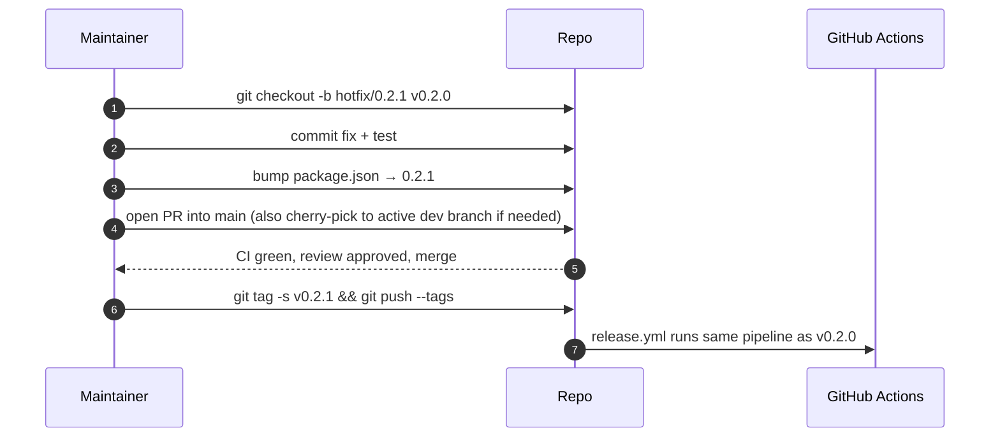

**Rules for hotfixes**:

1. Only touch the code that fixes the bug. No opportunistic refactors on a hotfix branch.
2. Every hotfix ships with a regression test. The test must **fail** on the buggy commit and **pass** on the fix.
3. If the bug exists on `main` too, the same fix lands there in a separate PR (or the cherry-pick goes both ways).
4. Hotfix tags follow SemVer: `vX.Y.(Z+1)`. They never bump MINOR.

---

## Upgrading — user playbook

### npm (most common)

```bash
# See what's installed.
forge --version

# Check what's available without upgrading.
npm view @hoangsonw/forge version

# Upgrade to the latest stable.
npm install -g @hoangsonw/forge@latest

# Opt into beta.
npm install -g @hoangsonw/forge@beta

# Opt into nightly (expect breakage).
npm install -g @hoangsonw/forge@nightly

# Pin an exact version.
npm install -g @hoangsonw/forge@0.2.0
```

### Docker

```bash
# Pull the latest stable.
docker pull ghcr.io/hoangsonw/forge-agentic-coding-cli:latest

# Pin to a major series (gets patch updates automatically).
docker pull ghcr.io/hoangsonw/forge-agentic-coding-cli:0

# Pin to an exact release.
docker pull ghcr.io/hoangsonw/forge-agentic-coding-cli:0.2.0
```

### Built-in updater

The CLI ships with an updater that checks the npm registry on a cadence, announces a new version in the REPL, and can apply it with one command.

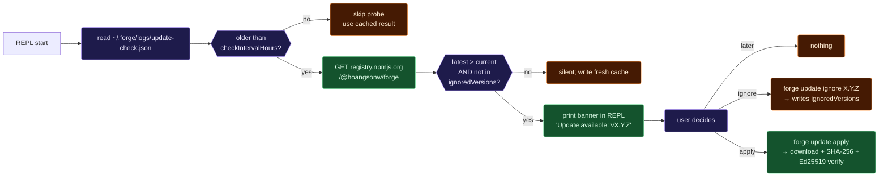

Relevant commands:

| Command | What it does |
|---|---|
| `forge update check` | Force a registry probe now, regardless of cache. |
| `forge update apply` | Download the latest release for the current channel, verify, and install. |
| `forge update apply --channel beta` | Same, but pulls from the `beta` dist-tag. |
| `forge update ignore <version>` | Suppress the update banner for that specific version. |

Config lives in `~/.forge/config.json`:

```json
{
  "update": {
    "autoCheck": true,
    "channel": "stable",
    "checkIntervalHours": 24,
    "ignoredVersions": []
  }
}
```

---

## Pinning & rollback

### Pin a version (reproducible installs)

```bash
# Pin in a shell script.
npm install -g @hoangsonw/forge@0.2.0

# Pin in a Dockerfile.
FROM ghcr.io/hoangsonw/forge-agentic-coding-cli:0.2.0

# Pin in a package.json (when Forge is used as a dep, not a global CLI).
{
  "devDependencies": {
    "@hoangsonw/forge": "0.2.0"
  }
}
```

### Roll back

```bash
# npm — downgrade explicitly.
npm install -g @hoangsonw/forge@1.0.0

# Docker — swap the tag.
docker pull ghcr.io/hoangsonw/forge-agentic-coding-cli:1.0.0

# Tell the built-in updater to stop nagging about a broken version.
forge update ignore 0.2.0
```

The updater will **never** downgrade you automatically — you opt into the channel you want, and rollback is always a manual action.

---

## Artifact verification (SHA-256 + Ed25519)

Every release ships with two integrity layers. You don't have to do anything to get them — the built-in updater enforces both by default — but the docs here describe what's happening under the hood so you can reproduce verification by hand.

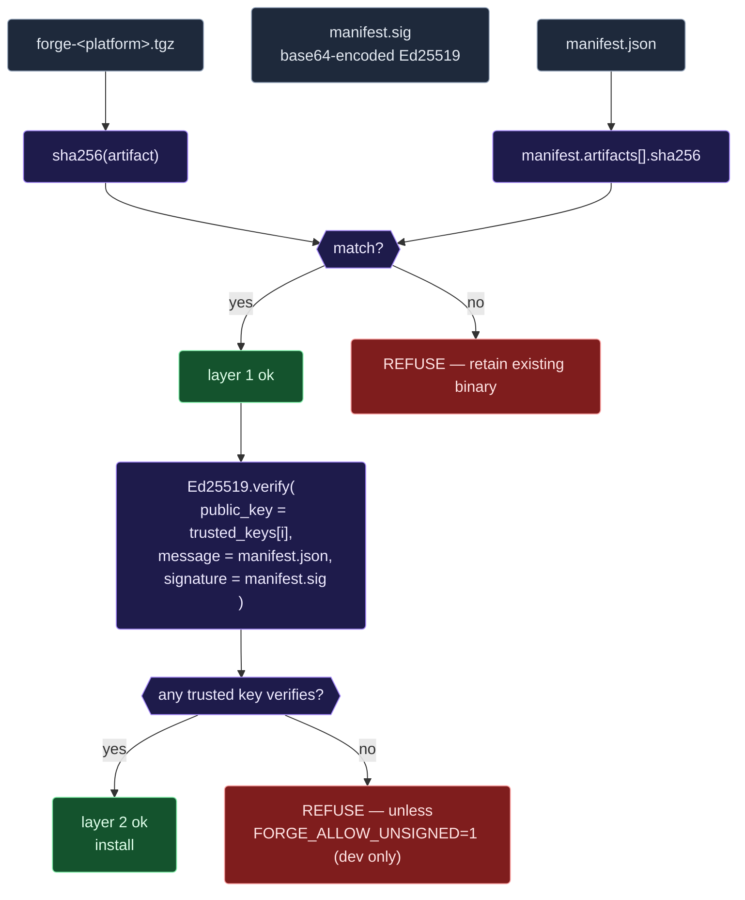

### Verifying by hand

```bash
# 1. Fetch the three release assets.
gh release download v0.2.0 \
  --pattern 'forge-linux-x64*.tgz' \
  --pattern 'manifest.json' \
  --pattern 'manifest.sig'

# 2. Verify SHA-256. The expected value comes from the manifest.
expected=$(jq -r '.artifacts[] | select(.name | startswith("forge-linux-x64")).sha256' manifest.json)
actual=$(shasum -a 256 forge-linux-x64*.tgz | awk '{print $1}')
test "$expected" = "$actual" && echo "sha256 ok" || { echo "MISMATCH"; exit 1; }

# 3. Verify the Ed25519 signature using the trusted key list baked into the CLI.
#    (The `forge release verify` subcommand does this end-to-end.)
forge release verify --manifest manifest.json --signature manifest.sig
```

### Key rotation

Trusted keys live in [`src/release/trusted-keys.json`](src/release/trusted-keys.json) and are shipped with every binary. Rotations are additive: the old key retains trust for a grace window (`rotatedOutAt` in the future) so signatures produced before the rotation keep verifying. Once the grace window passes, the old key is removed from the list and only new signatures verify.

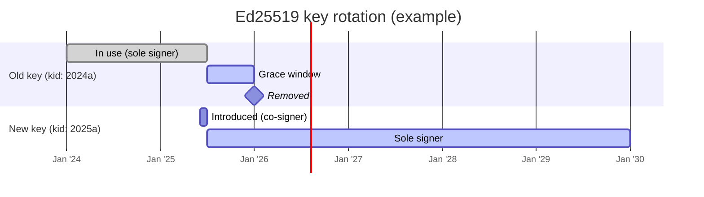

### Dev-only escape hatch

Set `FORGE_ALLOW_UNSIGNED=1` in your shell to bypass signature verification. This is only for local development of the release code path itself — if it's ever set in production, loud warnings hit the log, and you should treat that artifact as untrusted.

---

## The built-in updater

Source of truth: [`src/daemon/updater.ts`](src/daemon/updater.ts).

### State machine

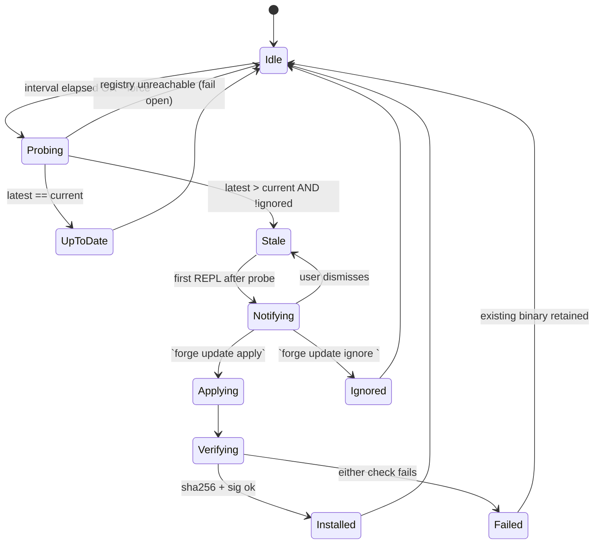

### Caching behavior

- `~/.forge/logs/update-check.json` stores the last probe result.
- Probes are skipped if the cache is younger than `update.checkIntervalHours` (default 24h).
- The probe is **fail-open**: if the registry is unreachable, the cache is marked "unknown" rather than "stale" — we never nag a user based on a failed probe.
- `ignoredVersions` suppresses nags for specific versions forever (until the user manually un-ignores or installs past them).

---

## Deprecation policy

A public surface may be **deprecated** in one MINOR release and **removed** no earlier than the next MAJOR. Deprecations emit a one-time warning to stderr on first use per process.

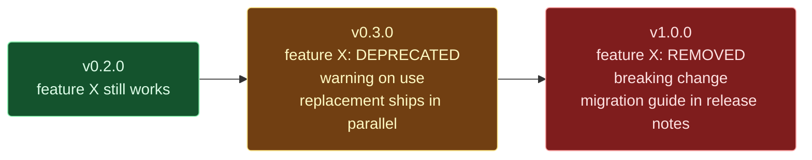

Each deprecation includes, in the MINOR that introduces it:
- A **stderr warning** naming the replacement.
- A **release-notes entry** under a `Deprecated` heading.
- A **migration snippet** in `RELEASES.md` showing old → new usage.

---

## Emergency procedures

### A release went out with a critical bug

1. **Do not delete the tag or the npm version.** Deleting published npm versions breaks every user who pinned to that version. Deprecate it instead.
2. Ship a hotfix: see [Hotfix flow](#hotfix-flow).
3. Deprecate the broken version on npm:
   ```bash
   npm deprecate '@hoangsonw/forge@0.2.0' 'Broken: upgrade to 0.2.1 (SHA-256 mismatch on linux-arm64).'
   ```
4. Update the GitHub Release description for `v0.2.0` to note the issue and link to `v0.2.1`.
5. If the bug is a **security** issue, follow the Security section in [`SECURITY.md`](SECURITY.md) before public disclosure.

### The signing key was compromised

1. Rotate the Ed25519 key immediately — generate a new keypair, update `src/release/trusted-keys.json` with the new public key, mark the old key `rotatedOutAt: <now>`, and update `secrets.FORGE_RELEASE_ED25519_PRIV` in the repo's GitHub Actions secrets.
2. Cut a patch release so users pick up the new trusted-keys list.
3. Announce the rotation in the release notes and in `SECURITY.md`.

### GitHub Actions is down

The release workflow is the blessed path, but for maintainers with local access to the signing key, a manual release is possible:
1. `npm pack` for each platform (or use a pre-built matrix locally via Docker).
2. Compute SHA-256 for each artifact, build `manifest.json`.
3. Sign with `openssl pkeyutl -sign -inkey ed25519.key -rawin -in manifest.json -out manifest.sig.bin`.
4. `npm publish --provenance` is Actions-only — skip provenance on the manual path and call that out in the release notes.
5. Re-run the tag through the normal workflow as soon as Actions is healthy so the provenance attestation catches up.

---

## FAQ

**Q: How do I know which version I'm running?**
`forge --version` prints the version, commit SHA, and build date.

**Q: Will the built-in updater ever surprise me with an install?**
No. It checks and notifies, but `apply` is always an explicit command.

**Q: My company doesn't allow outbound HTTPS to npm/GHCR. What now?**
Download the platform tarball from the GitHub Release, verify the SHA-256 against the signed manifest, and install from the tarball. The verification flow works fully offline once you have the three files.

**Q: Can I host my own mirror?**
Yes. The updater reads `FORGE_RELEASE_REPO` (for the GitHub API URL) and the npm registry URL from the standard npm config. Point both at your mirror and Forge will check and install from there. The trusted-keys list is still enforced — sign your mirror's releases with a key that's in the trusted list, or rebuild Forge from source with your own keys.

**Q: Where do I report a security issue?**
[`SECURITY.md`](SECURITY.md) has the current disclosure address. Don't file a public GitHub issue for security bugs.

**Q: How stable is the on-disk SQLite schema?**
Stable within a MAJOR. Migrations under [`src/migrations/runner.ts`](src/migrations/runner.ts) cover every bump — they're additive and idempotent. The CLI runs pending migrations at startup.

**Q: What does "100% passing" mean in the CI badge if coverage is only ~35%?**
"Passing" = every test that exists succeeds. "Coverage" = what fraction of production code those tests exercise. We hold the first at 100% always, and improve the second over time — see `npm run test:coverage` for the live number.

---

## Release notes

<!-- Newest at the top. Keep the template from
     "Release-notes template" above. -->

### v1.0.0 — 2026-04-27

#### Highlights
- First stable release. Runtime, agentic loop, persistence, permissions, sandbox, and provider abstractions are now stable surface area; future breaking changes bump MAJOR.
- New first-class **VS Code extension** (`hoangsonw.forge-agentic-coding-cli`) with activity-bar webview, stats grid, recent tasks, and deep-linking from any task into the dashboard's conversation view.
- **Dashboard URL deep-linking** — `?task=<id>` opens task detail; `?view=<name>` jumps to a named view. Used by the VS Code extension and any other surface that links into the dashboard.
- Cross-project task detail lookup via `/api/tasks/:id` — resolves the project automatically from the global index.

#### Added
- VS Code extension surface (separate npm package + Marketplace listing).
- `?task=` / `?view=` deep-link routing in the dashboard SPA.
- Plan-edit modal in the dashboard (JSON editor for plan approval).
- Per-task delta replay buffer so late-connecting WebSocket clients see prior tokens.
- Demo recordings + VS Code screenshot on the landing page.

#### Changed
- Live markdown streaming uses rAF-coalesced reflow instead of dump-at-end.
- REPL completion summary now matches `forge run` formatting.
- Status-bar reachability indicator HTTP-probes before flipping to offline.
- Plans wait for explicit user decision in the UI; no silent auto-approval.

#### Fixed
- Streaming previously dropped deltas due to a task-id mismatch between the UI runner and the orchestrator.
- Recent-task rows in the VS Code sidebar are now clickable and show the right status.
- Cross-project task detail lookups no longer 404.

### v0.1.1 — 2026-04-20

#### Highlights
- Initial public release line.

#### Added
- Baseline toolset, provider registry, agentic loop, permission manager, sandbox, and SQLite-backed persistence.
- Signed release pipeline with SHA-256 + Ed25519 verification.

#### Internal
- Test suite: 249 tests across 43 files.

### v0.1.0 — 2026-04-15

#### Highlights
- Initial tagged release for internal validation.
