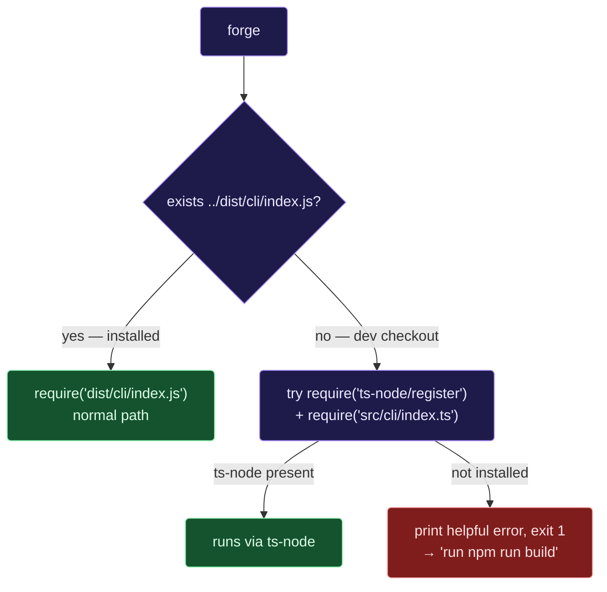

# `bin/`

The thin shim that becomes the `forge` command on `$PATH` when you
install the npm package.

## What's here

```
bin/
├── README.md   ← you are here
└── forge.js    ← the only file that matters; ~30 lines
```

`bin/forge.js` is a Node shebang script. It does one thing: locate the
compiled CLI (or fall back to `ts-node` for dev) and forward `argv`.

## How `forge` becomes a command

`package.json` declares the binary:

```jsonc
"bin": {
  "forge": "bin/forge.js"
}
```

When you `npm install -g @hoangsonw/forge`, npm:
1. Reads the `bin` field.
2. Creates a symlink named `forge` in your global `$PATH` (e.g.
   `/usr/local/bin/forge` or `~/.npm-global/bin/forge`).
3. Points it at the installed copy of `bin/forge.js`.

From then on, typing `forge` on the shell runs this shim, which loads
the compiled CLI from `dist/`.

## Resolution path at runtime



Why both paths?

- **Installed (`dist/` exists)**: fast cold start (~170 ms for
  `forge doctor`), no ts-node overhead, no TypeScript dependency.
- **Dev (`dist/` missing)**: lets contributors iterate on `src/*.ts`
  without running `npm run build` between every change.

## Invocation styles

Three ways to run Forge locally during dev:

| Command | When to use |
|---|---|
| `forge ...` | You installed globally (`npm i -g` or `npm link`). Normal user experience. |
| `./bin/forge.js ...` | From inside a repo checkout. No install needed; uses the shim directly. |
| `node bin/forge.js ...` | Same as above, explicit. Useful for shell aliases that need `node` flags (e.g., `--inspect`). |

All three resolve to the same entry point. Pick whatever is ergonomic.

## Dev loop cheat sheet

```bash
# Compile once, then use the installed binary.
npm run build && forge doctor

# Dev fallback — skip the build; ts-node compiles on the fly.
./bin/forge.js doctor

# Debug with the Node inspector.
node --inspect-brk bin/forge.js run "hello"

# Re-link after a clean:
npm run relink   # unlinks, builds, links
```

## Node version

The shim only requires a working `node` on `$PATH`. Forge itself needs
**Node 20+** (`engines.node` in `package.json`). If an older Node is
first on `$PATH`, the CLI exits early with a version check message —
not the shim's responsibility.

## Platform notes

- **Unix (macOS / Linux)**: shebang works directly; the file has the
  executable bit set (`chmod +x bin/forge.js`).
- **Windows**: npm creates a `.cmd` wrapper alongside the `forge`
  symlink when installing globally. If you run
  `node bin/forge.js ...` on Windows, it works identically; the shim
  doesn't touch paths as strings.

## Troubleshooting

| Symptom | Likely cause | Fix |
|---|---|---|
| `forge: command not found` | Global bin dir not on `$PATH`. | `npm bin -g` → add that dir to `$PATH`. |
| `Cannot find module '.../dist/cli/index.js'` | Fresh clone, no build yet. | `npm run build` or install `ts-node`. |
| `Compiled output not found and ts-node is unavailable.` | Dev fallback exhausted. | The shim's own error — run the build. |
| Changes to `src/*.ts` don't take effect | You're running the compiled `dist/`, which is stale. | `npm run build` (or use `./bin/forge.js` to force the ts-node path). |
| `forge` runs an old version after upgrade | Old symlink on `$PATH` ahead of the new one. | `which -a forge` → remove / replace the stale entry. |

## Scope

**This directory is stable.** The shim contract — "find the CLI, forward
argv, fail helpfully" — hasn't changed and isn't expected to. If you're
looking for the actual CLI implementation, it lives in
[`src/cli/`](../src/cli/); the compiled output ends up in `dist/cli/`.
