# Forge — Architecture Document

> [!TIP]
> The engineering map. Every diagram and file reference here reflects what
> lives in `src/` today, so you can grep from any claim straight to the code.

> [!NOTE]
> Visit the NPM package of Forge for more information: [`@forge/agentic-coding`](https://www.npmjs.com/package/@hoangsonw/forge).

## Table of contents

- [1. Layered overview](#1-layered-overview)
- [2. Agentic loop](#2-agentic-loop)
- [3. Task state machine](#3-task-state-machine)
- [4. Executor — iterative tool-use with validation gate](#4-executor--iterative-tool-use-with-validation-gate)
- [5. Memory layers](#5-memory-layers)
- [6. Model routing & provider registry](#6-model-routing--provider-registry)
- [7. Permission + sandbox model](#7-permission--sandbox-model)
- [8. Conversation & persistence](#8-conversation--persistence)
- [9. UI topology](#9-ui-topology)
- [10. CI/CD pipeline](#10-cicd-pipeline)
- [11. Deployment topologies](#11-deployment-topologies)
- [12. Runtime metrics at a glance](#12-runtime-metrics-at-a-glance)
- [13. Directory map](#13-directory-map)

---

## 1. Layered overview

Forge is organized into layers with clear dependencies. The core orchestrator and
loop are at the center, with agents, tools, and I/O surfaces radiating out.

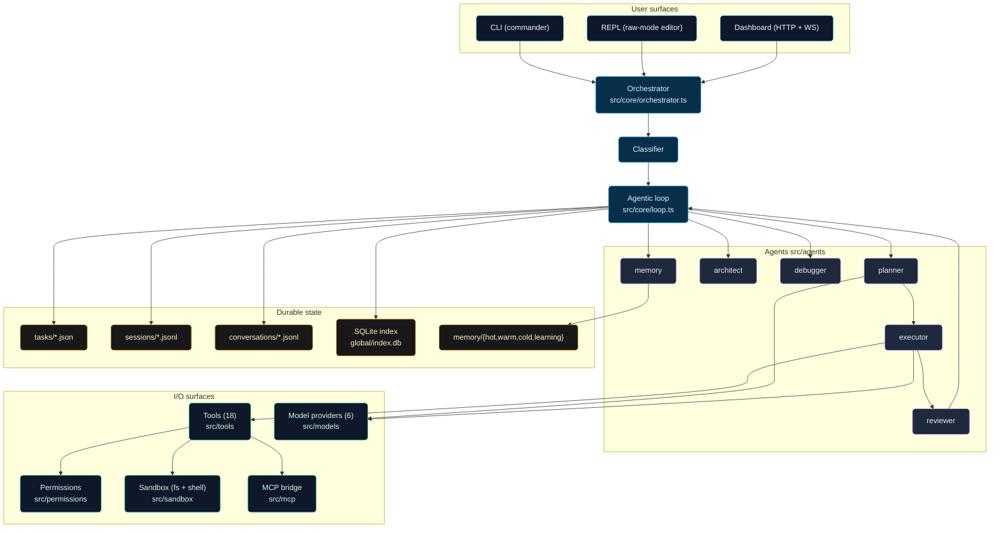

Code it maps to:

| Layer | Path |
|---|---|
| CLI surface | `src/cli/` (24 commands) |
| REPL | `src/cli/repl.ts` + `src/cli/repl-input.ts` |
| UI | `src/ui/server.ts` + `src/ui/public/` |
| Orchestrator | `src/core/orchestrator.ts` |
| Agentic loop | `src/core/loop.ts` |
| Agents | `src/agents/{planner,architect,executor,reviewer,debugger,memory}.ts` |
| Tools | `src/tools/*.ts` |
| Providers | `src/models/{ollama,openai,anthropic,llamacpp,vllm,lmstudio}.ts` |
| Permissions | `src/permissions/` |
| Sandbox | `src/sandbox/` |

---

## 2. Agentic loop

The canonical pipeline every non-trivial task flows through.

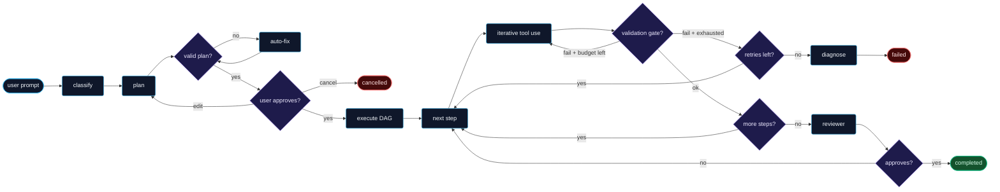

Source: `src/core/loop.ts:91` (entry: `runAgenticLoop`).

---

## 3. Task state machine

Forge unifies interactive sessions and background jobs under a single task model. Tasks transition through states in a DAG, with illegal moves throwing
`state_invalid`. Terminal states can only be re-entered via `forge resume`, which resets them to `draft` so the loop starts cleanly.

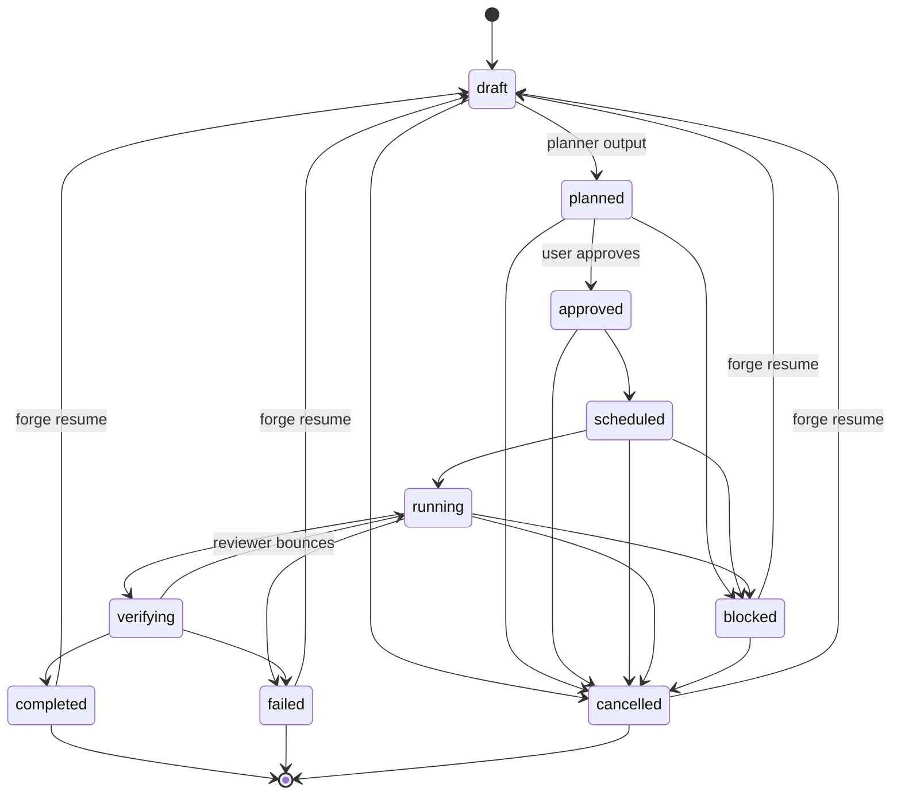

Source: `src/persistence/tasks.ts#LEGAL_TRANSITIONS`. Illegal moves throw
`state_invalid`. Terminal states can only be re-entered via `forge resume`,
which resets them to `draft` so the loop starts cleanly.

---

## 4. Executor — iterative tool-use with validation gate

Each plan step runs a **bounded tool-use conversation**, not a single model
call. The model sees every tool result and can adapt within the same step.

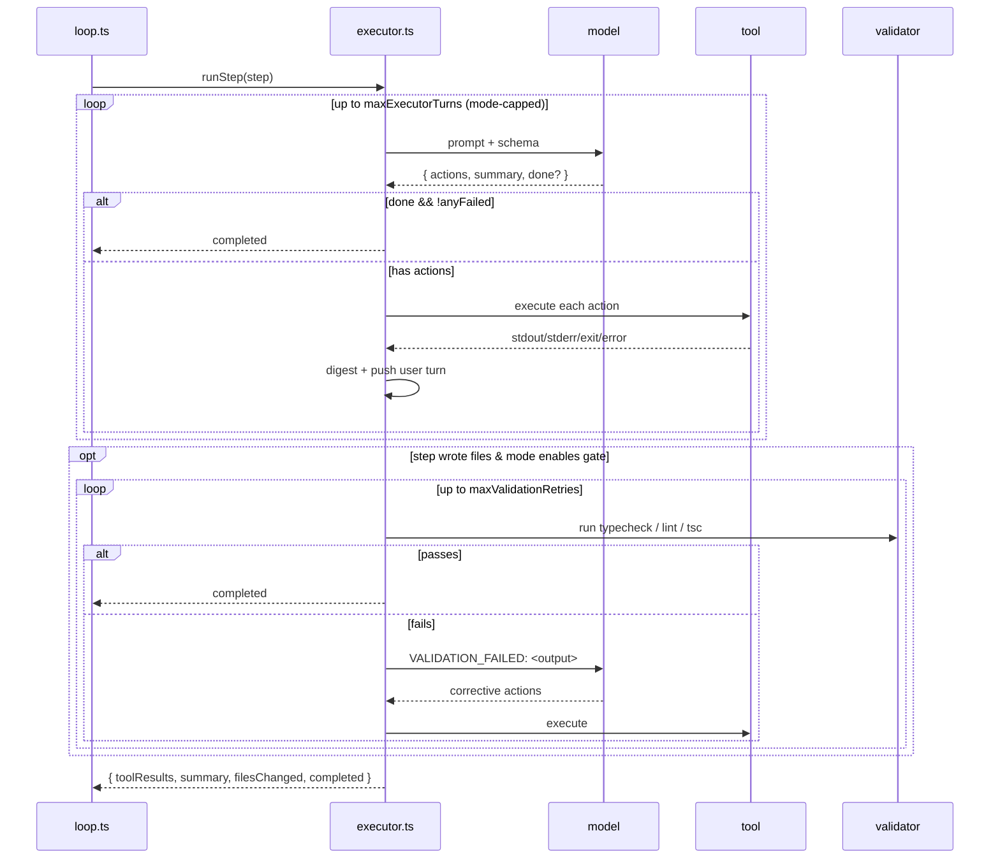

| Mode | maxExecutorTurns | maxValidationRetries | allowMutations |
|------|------------------|----------------------|----------------|
| fast | 2 | 0 | yes |
| balanced | 4 | 1 | yes |
| heavy | 8 | 2 | yes |
| plan | 0 → 1 (clamp) | 0 | no |
| audit | 3 | 0 | no |
| debug | 6 | 2 | yes |
| architect | 3 | 1 | yes |
| offline-safe | 3 | 1 | yes |

Source: `src/core/mode-policy.ts`, `src/agents/executor.ts`,
`src/core/validation.ts`.

---

## 5. Memory layers

Four tiers with distinct retention, access cost, and eviction:

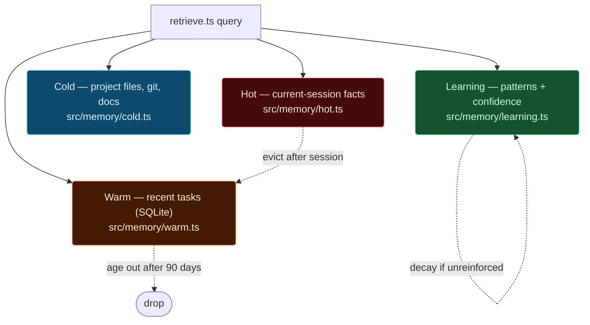

- **Hot** — in-process, per-task facts (current filesChanged, pending
  assertions). Cleared when the task completes.
- **Warm** — recent task metadata in SQLite (`global/index.db`). Feeds
  "what was I doing last week?" queries in the REPL and UI.
- **Cold** — lazy file/grep/AST index scoped to `projectRoot`. Populated
  on demand; no background indexer.
- **Learning** — patterns keyed by `intent:scope` with confidence evolving
  on success/failure. Planner reads the top-K before producing a plan
  (`src/agents/planner.ts#learnedPatternBlock`).

Retention defaults live in `GlobalConfig.memory` (`src/config/schema.ts`).

---

## 6. Model routing & provider registry

Forge abstracts providers behind a common interface. The router picks the best
provider for each request based on configured preferences, availability, and
model catalogue metadata (e.g. context window, supported features).

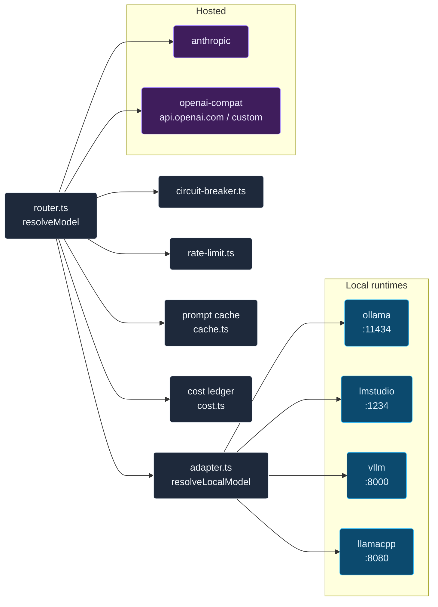

**Local-model catalogue** (`src/models/local-catalog.ts`) classifies every
Llama / Qwen / DeepSeek / Gemma / Phi / Mistral / CodeLlama / Codestral /
StarCoder / Granite / Yi / Solar / Command-R / Aya / … id — 41 families
total — into `{class, roles, contextTokens}`.

**Adapter** (`src/models/adapter.ts`) auto-substitutes when the configured
model isn't installed on the user's provider. Picks best-fit from what's
actually there, caches per process, warns once.

---

## 7. Permission + sandbox model

Forge classifies every tool invocation by risk level and side effect, then applies a policy based on the current session flags and user preferences. The most
risky operations (e.g. shell commands with critical risk) are hard-blocked regardless of user preferences.

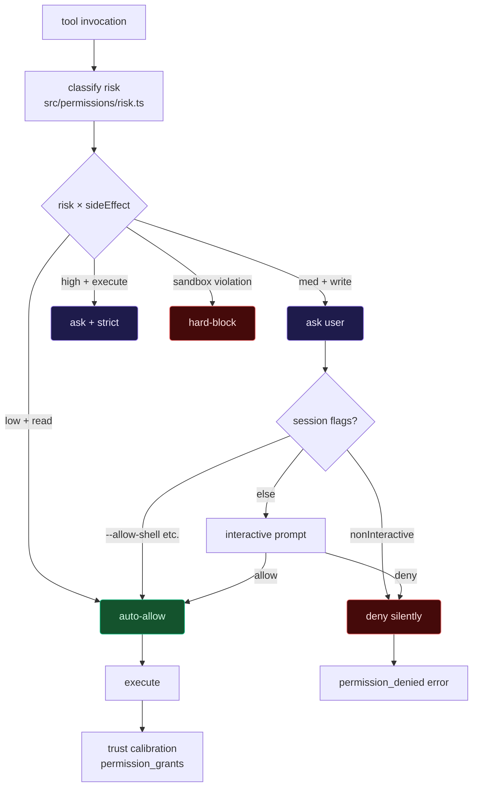

- All paths resolved via **realpath** + confined to `projectRoot` plus
  explicitly whitelisted extra roots (`src/sandbox/fs.ts`).
- Always-forbidden targets: `/etc/passwd`, SSH keys, AWS credentials, etc.
- Shell commands classified (`classifyCommandRisk`) before execution;
  `critical` is hard-blocked.
- Grants persist in SQLite (`permission_grants` table) scoped per
  project + tool.

---

## 8. Conversation & persistence

Two concurrent writers — the REPL and the UI — can edit the same
conversation without corruption thanks to POSIX `O_APPEND` + a `mkdir`
fallback for lines >4 KB.

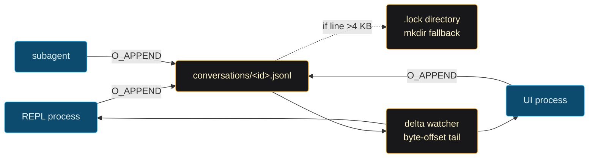

Source: `src/persistence/conversation-store.ts`, `src/core/conversation.ts`.
Event schema: `session-created`, `turn-user`, `turn-result`, `meta-updated`.

---

## 9. UI topology

Forge's dashboard is a single-page app served by a Node HTTP server. It uses WebSockets for real-time updates on tasks and conversations, and REST endpoints for actions like cancelling tasks or fetching details.

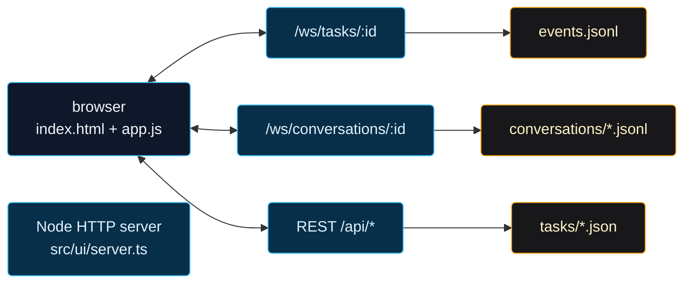

- Ref-counted broadcasters so multiple tabs share a single file watcher.
- Conversation ids validated against `^(?:repl|chat|conv)-[a-z0-9_-]+$`
  for path-traversal safety.
- Healthcheck endpoint `/api/status` used by the Docker HEALTHCHECK.

---

## 10. CI/CD pipeline

Forge enforces code quality and release safety with a multi-stage pipeline on GitHub Actions. Every push runs the full suite; releases add gated steps for building, signing, and publishing artifacts.

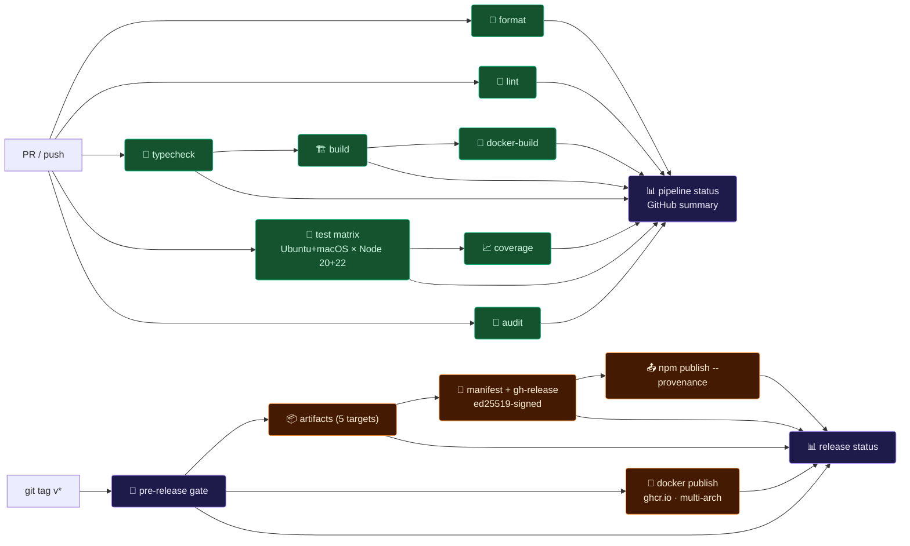

Source: `.github/workflows/{ci,release,nightly}.yml`.

---

## 11. Deployment topologies

Forge can be installed globally via npm, run as a container with volume mounts for state, or orchestrated with Docker Compose alongside Ollama for a fully containerized local setup.

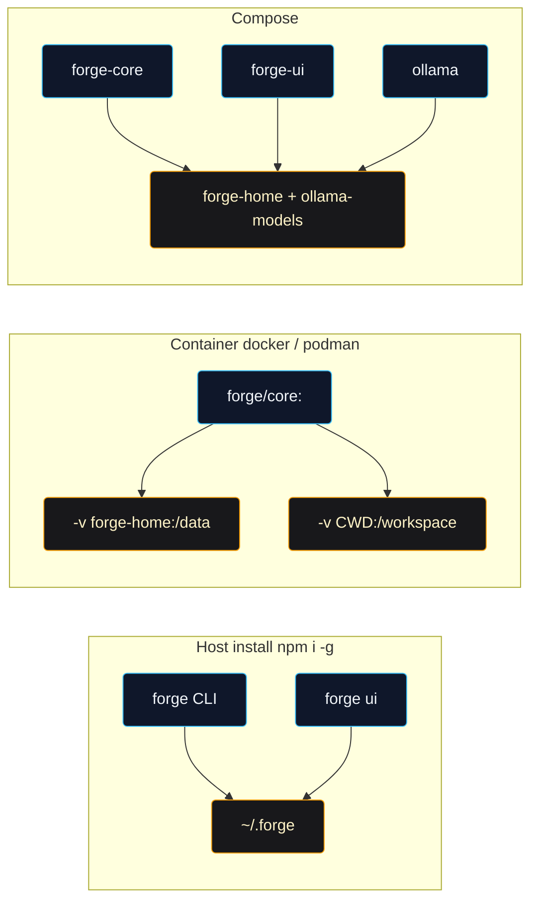

---

## 12. Runtime metrics at a glance

Measured with reproducible commands. No synthetic benchmarks.

| Target | Value | Reproducer |
|--------|-------|------------|
| `forge doctor` cold-start | **173 ms** | `time node bin/forge.js doctor --no-banner` |
| `forge --help` cold-start | **238 ms** | `time node bin/forge.js --help` |
| Provider probe timeout | **1.5 s** | `src/models/openai.ts#isAvailable` |
| UI `app.js` uncompressed | **89 KB** (zero CDN fetches) | `wc -c src/ui/public/app.js` |
| Full test suite | **~3.3 s** wall-clock | `npx vitest run` |
| Tests | **249 / 43 files** · 100% passing | — |
| Container image | **~355 MB** multi-arch non-root | `docker images ghcr.io/hoangsonw/forge-agentic-coding-cli` |

Executor turn budget per mode (hard runtime cap, from
`src/core/mode-policy.ts`):

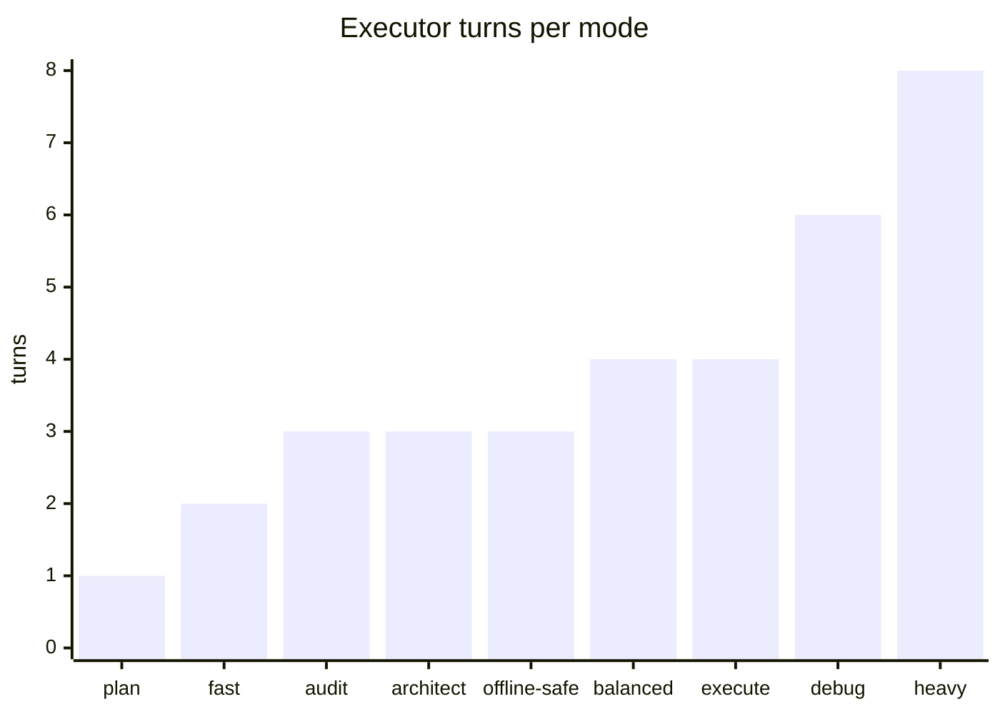

---

## 13. Directory map

```
src/
├── cli/            # commander CLI + 24 commands + REPL + input editor
├── core/           # orchestrator, agentic loop, mode-policy, validation
├── agents/         # 6 agents (planner/architect/executor/reviewer/debugger/memory)
├── classifier/     # heuristic + LLM task classification
├── models/         # 6 providers + router + adapter + catalog
├── prompts/        # layered assembler, deterministic hash
├── tools/          # 18 tools (read/write/edit/grep/glob/run/git/web/…)
├── sandbox/        # fs scope + command risk classifier
├── permissions/    # risk classifier + interactive manager + trust calibration
├── persistence/    # tasks, sessions, conversations, events, SQLite index
├── memory/         # 4-layer memory + retrieval
├── scheduler/      # DAG + resource manager (concurrency permits)
├── ui/             # HTTP + WS dashboard; public/ = app shell
├── mcp/            # Model Context Protocol bridge
├── daemon/         # optional background process
├── keychain/       # macOS/Linux/Windows credential storage
├── release/        # manifest signing + verification
├── security/       # prompt-injection guard, redaction
├── logging/        # structured logger + rotation
├── config/         # zod schema + XDG paths
└── types/          # shared contracts
```
