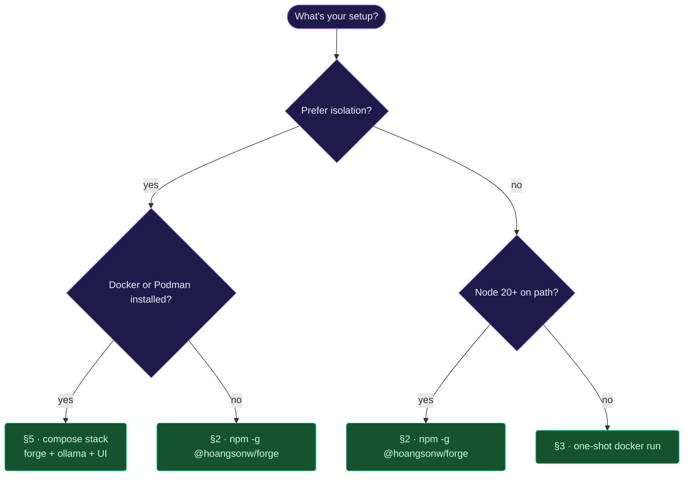
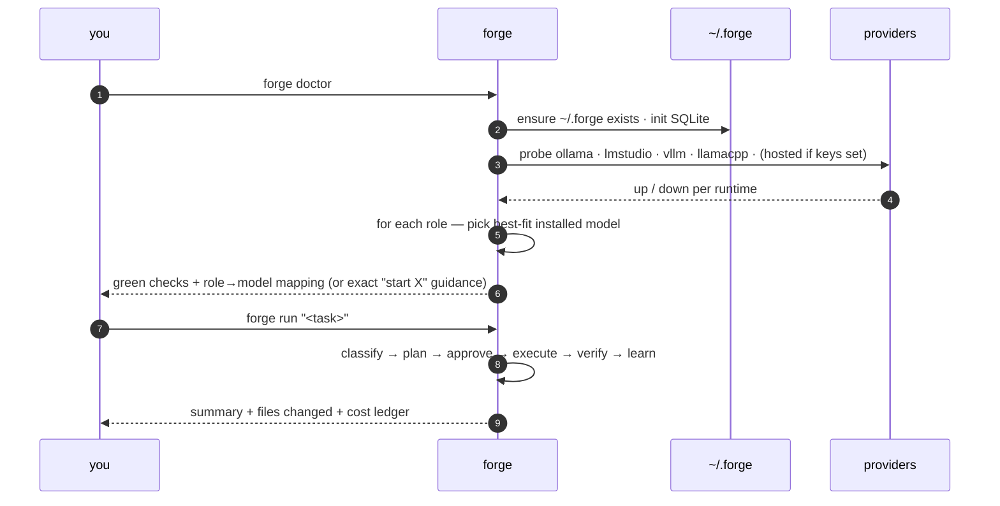
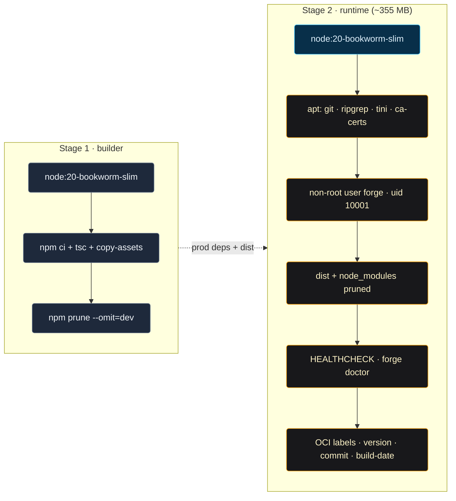
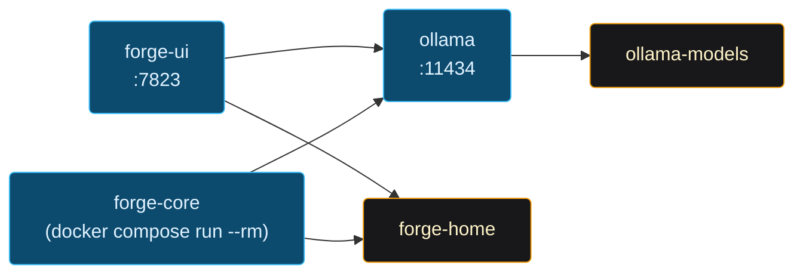
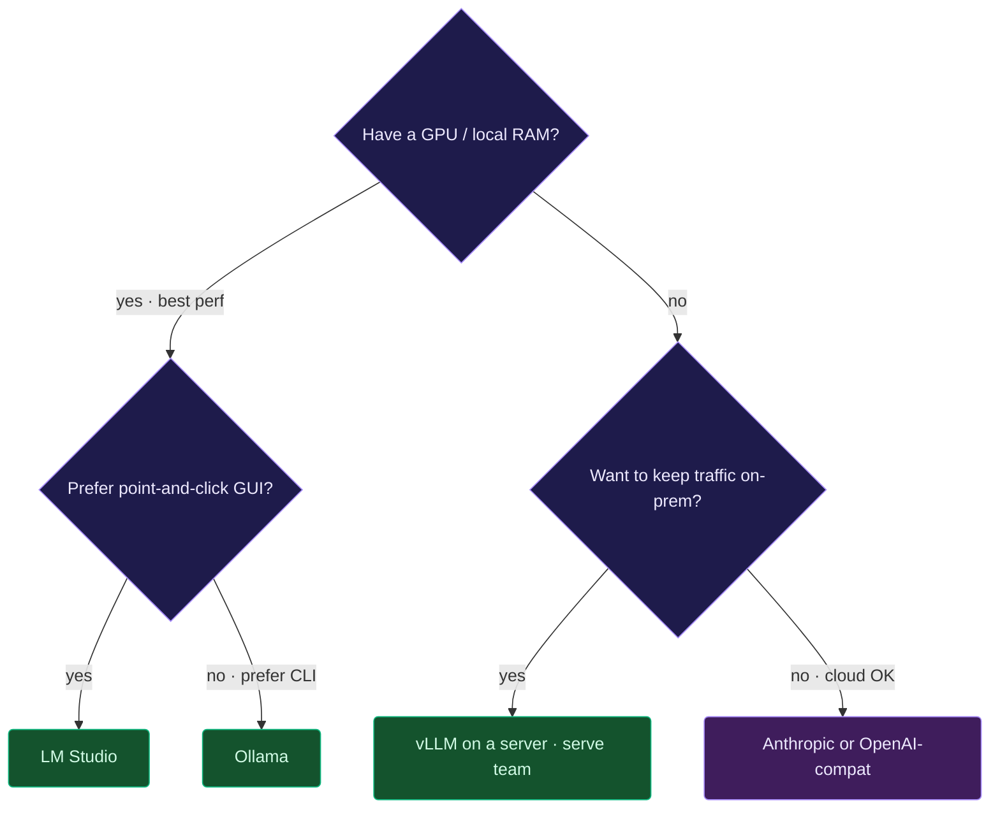

# Forge — Installation

> End-user install guide. If you want to hack on Forge itself, see
> [SETUP.md](SETUP.md).

## Table of contents

- [0. System requirements](#0-system-requirements)
- [1. Choose your install path](#1-choose-your-install-path)
- [2. npm (global)](#2-npm-global)
- [3. Docker](#3-docker)
- [4. Podman](#4-podman)
- [5. Compose (Forge + Ollama + UI)](#5-compose-forge--ollama--ui)
- [6. Platform-specific notes](#6-platform-specific-notes)
- [7. Model runtimes you can point Forge at](#7-model-runtimes-you-can-point-forge-at)
- [8. First-run checklist](#8-first-run-checklist)
- [9. Uninstall](#9-uninstall)
- [10. Troubleshooting](#10-troubleshooting)

---

## 0. System requirements

Forge runs anywhere Node 20+ runs. The Docker path has no host-side Node requirement at all.

| | Minimum | Notes |
|---|---|---|
| **Node.js** | **≥ 20** (22 tested in CI) | Enforced via `package.json#engines`. Skip if you use Docker. |
| **OS** | macOS · Linux · Windows (native or WSL) | `better-sqlite3` ships prebuilds for darwin-x64, darwin-arm64, linux-x64, linux-arm64, win32-x64 — no toolchain needed on `npm install`. |
| **Disk** | ~150 MB `node_modules`; state under `~/.forge` grows with history | Override via `FORGE_HOME`. |
| **RAM** | Forge: ~100 MB resident. Your local model: whatever the model needs. | `forge doctor` cold-starts in ~170 ms. |
| **Docker** (alt path) | ≥ 25 | Multi-arch image `ghcr.io/hoangsonw/forge-agentic-coding-cli:latest`. Amd64 + arm64. |
| **At least one model source** | Local runtime or hosted key | See [§7](#7-model-runtimes-you-can-point-forge-at). `forge doctor` probes all of them. |

**Runtime npm dependencies** (13 total, **zero optional**): `@modelcontextprotocol/sdk`, `better-sqlite3`, `chalk`, `cli-table3`, `commander`, `dotenv`, `ora`, `prompts`, `semver`, `undici`, `ws`, `yaml`, `zod`. No Python, Rust, or Go required — `better-sqlite3` is the only native module and ships prebuilt binaries.

**Recommended** (not required): `ripgrep` (fast path for the `grep` tool), `git` (for `git_diff`/`git_status` tools and project-root detection), `$EDITOR` (used when you pick "Edit" on a plan approval).

---

## 1. Choose your install path



| Path | Best for | Keeps host clean? |
|------|----------|-------------------|
| npm -g | you already have Node + your own LLM | ⚠️ installs to your npm prefix |
| docker run | quick try, no Node needed | ✅ |
| compose | want Ollama + UI + Forge in one stack | ✅ |
| podman-compose | rootless container setup | ✅ |

---

## 2. npm (global)

```bash
npm install -g @hoangsonw/forge
forge doctor       # verify
forge init         # create ~/.forge
forge run "explain this repo"
```

Requirements: **Node 20+**. macOS, Linux, Windows (via WSL or native —
see §6).

### What happens on first run



Upgrade:

```bash
npm update -g @hoangsonw/forge
```

Local install from a checkout (for PR testing):

```bash
git clone https://github.com/hoangsonww/Forge-Agentic-Coding-CLI && cd forge
npm install
npm run build
npm link              # adds `forge` to PATH
```

---

## 3. Docker

### Image anatomy



Pull:

```bash
docker pull ghcr.io/hoangsonw/forge-agentic-coding-cli:latest
```

One-shot invocation (your CWD → `/workspace`):

```bash
docker run --rm -it \
  -v forge-home:/data \
  -v "$PWD:/workspace" \
  ghcr.io/hoangsonw/forge-agentic-coding-cli:latest \
  forge run "explain this repo"
```

Dashboard:

```bash
docker run --rm -p 7823:7823 \
  -v forge-home:/data \
  ghcr.io/hoangsonw/forge-agentic-coding-cli:latest \
  forge ui start --bind 0.0.0.0
# open http://127.0.0.1:7823
```

Image facts (from `docs/metrics.json`):

- multi-stage build, **~355 MB** final
- runs as non-root user `forge` (uid 10001)
- HEALTHCHECK wired to `forge doctor`
- multi-arch: `linux/amd64`, `linux/arm64`
- OCI labels carry version + commit + build date

Build locally from a clone:

```bash
docker build -f docker/Dockerfile -t forge/core:dev .
```

---

## 4. Podman

Everything in §3 works by swapping `docker` for `podman`:

```bash
podman pull ghcr.io/hoangsonw/forge-agentic-coding-cli:latest
podman run --rm -it \
  -v forge-home:/data \
  -v "$PWD:/workspace" \
  ghcr.io/hoangsonw/forge-agentic-coding-cli:latest
```

Rootless mode is supported — the image uses a static uid (10001) so
volume ownership is predictable across hosts.

---

## 5. Compose (Forge + Ollama + UI)

```bash
git clone https://github.com/hoangsonww/Forge-Agentic-Coding-CLI && cd forge
docker compose -f docker/docker-compose.yml up -d
# or:
podman-compose -f docker/docker-compose.yml up -d
```

What it runs:



Invoke the CLI on demand:

```bash
docker compose -f docker/docker-compose.yml run --rm forge-core \
  forge run "refactor src/api/*.ts"
```

Tear down:

```bash
docker compose -f docker/docker-compose.yml down
# keep volumes:     add --volumes to wipe them
```

---

## 6. Platform-specific notes

### macOS

- Apple Silicon: Docker image runs `linux/arm64` natively.
- Keychain integration: `src/keychain/mac.ts` uses the Security framework.
- Gatekeeper: the npm install is a plain Node install, no codesigning needed.

### Linux

- Rootless Podman works out of the box.
- SELinux: mount with `:Z` if volume labels matter —
  `-v "$PWD:/workspace:Z"`.
- Keychain: `src/keychain/linux.ts` tries `libsecret` first, falls back
  to an encrypted file in `$XDG_DATA_HOME`.

### Windows

- PowerShell:
  ```powershell
  npm install -g @hoangsonw/forge
  forge doctor
  ```
- WSL 2: preferred for shell-intensive workflows (ripgrep, git).
- Keychain: `src/keychain/windows.ts` uses DPAPI.

---

## 7. Model runtimes you can point Forge at

Forge auto-detects these on their default ports — **no env vars needed**
when you're running on the defaults:

| Runtime | Default endpoint | Notes |
|---------|------------------|-------|
| Ollama | `http://127.0.0.1:11434` | `ollama serve`; models via `ollama pull …` |
| LM Studio | `http://127.0.0.1:1234/v1` | "Local Server → Start Server" |
| vLLM | `http://127.0.0.1:8000/v1` | `vllm serve <model>` |
| llama.cpp | `http://127.0.0.1:8080/v1` | `llama-server -m model.gguf` |
| OpenAI-compatible | `OPENAI_BASE_URL` | LocalAI, Together, Groq, Azure, Fireworks |
| Anthropic | hosted | `ANTHROPIC_API_KEY` |

Override endpoints per runtime: `OLLAMA_ENDPOINT`, `LMSTUDIO_ENDPOINT`,
`VLLM_ENDPOINT`, `LLAMACPP_ENDPOINT`, `OPENAI_BASE_URL`.

Forge's catalog classifies **41 model families** — Llama 3/3.1/3.2/3.3/4,
Qwen 2/2.5/3 + Coder, DeepSeek V3/R1/Coder, Gemma 2/3, Phi 3/4,
Mistral/Mixtral/Nemo/Small/Large, Nemotron, Command-R/R+, Granite +
Granite-Code, CodeLlama, Codestral, StarCoder, Yi, Solar, Zephyr,
MiniCPM, LLaVA, TinyLlama, SmolLM, Aya, and more. Unknown models still
get a routable role rather than being refused.

### Picking a model that fits the work

Forge's agentic loop is multi-turn tool use with strict JSON output. That's
easy for frontier hosted models and hard for small local ones. These are
the tiers we've observed in practice — pull the right size for what you
intend to do, and set a hosted fallback for when you hit the ceiling.

| Task type | Local floor we trust | Example pulls | Notes |
|---|---|---|---|
| Chat / concept Q&A | 3B instruct | `phi3:mini`, `gemma3:2b`, `qwen2.5:3b` | Uses the conversation fast-path; no tool use required. |
| Summarize / explain code | 7B instruct | `qwen2.5:7b`, `llama3.1:8b` | Narrator pass runs non-JSON and streams cleanly. |
| Single-file edits / small features | **7B+ code specialist** | `deepseek-coder:6.7b`, `qwen2.5-coder:7b` | Multi-step tool use; general 7B models often pick the wrong tool here. |
| Multi-file refactors / new features | 14B+ code specialist | `qwen2.5-coder:14b`, `deepseek-coder:33b` | Or route through a hosted frontier model. |
| Architecture-level changes | hosted only, realistically | Claude Opus/Sonnet, GPT-4-class | Context windows + plan quality matter. |

**Expected failure modes below the floor** (the rail guards flag these
rather than silently corrupting files):

- Wrong tool selection — e.g. `run_command` to write file contents.
  Executor prompt maps step types explicitly; unrecoverable calls surface
  loudly instead of looping.
- Escalating to `ask_user` on tool errors instead of retrying or switching
  tools. `ask_user` rejects empty/too-short questions as non-retryable.
- Splitting "create empty file, then edit to fill" across two steps.
  `edit_file` now handles empty-oldText on an empty file as a full-body
  write, so this legitimate pattern succeeds.
- Malformed JSON that breaks the executor's `{actions, summary, done}`
  contract. The run fails cleanly; no partial state is written.

**Configuring per-role models:**

```bash
forge config set models.planner qwen2.5:7b
forge config set models.code    deepseek-coder:6.7b
forge config set models.fast    phi3:mini

# Hosted fallback — router engages automatically on local failure / breaker open.
export ANTHROPIC_API_KEY=sk-…
# or:
export OPENAI_API_KEY=sk-…
```

First use of a local model triggers a visible `warming <model>` phase
before the first call — cold-loading a 7B into RAM/VRAM can take up to a
minute on slower machines. Subsequent calls are fast while Ollama keeps
it resident (5 min default).

### Runtime selection flow



---

## 8. First-run checklist

```bash
forge doctor            # 1. green checks + role→model mapping per provider
forge init              # 2. create ~/.forge; writes a project .forge/ when inside a repo
forge model list        # 3. verify what you can call
forge run "…task…"      # 4. your first real run
```

If `doctor` reports "No model provider is reachable", it prints **exactly**
what to start and which env vars unlock cloud fallback.

---

## 9. Uninstall

```bash
npm uninstall -g @hoangsonw/forge    # or remove the image:
docker rmi ghcr.io/hoangsonw/forge-agentic-coding-cli:latest

# optional — wipe state:
rm -rf ~/.forge                # global
rm -rf ./.forge                # per-project
```

Compose stack:

```bash
docker compose -f docker/docker-compose.yml down --volumes --remove-orphans
```

---

## 10. Troubleshooting

| Symptom | Likely cause | Fix |
|---------|--------------|-----|
| `forge: command not found` | npm global bin not on PATH | add `$(npm bin -g)` to PATH, or use `npx @hoangsonw/forge` |
| `No model provider is reachable` | nothing running on default ports | start Ollama / LM Studio / vLLM / llama.cpp, or export `ANTHROPIC_API_KEY` |
| `adapter: substituted model` warning | your configured model isn't pulled | either `ollama pull <id>` or accept the substitution (Forge picked the best-fit) |
| Container exits immediately | default CMD is `forge --help` | pass a subcommand: `docker run … ghcr.io/hoangsonw/forge-agentic-coding-cli:latest forge run "…"` |
| Permission prompts every single call | strict mode on, or no flags | `--skip-permissions` for routine tools, or `--allow-shell` / `--allow-files` |
| UI can't reach backend services | bind address wrong | `forge ui start --bind 0.0.0.0 --port 7823` |
| SQLite locked | daemon + REPL both writing | Forge handles this with O_APPEND; if you see this, file an issue with the full log |

Further diagnostics: `forge doctor --no-banner` for a machine-friendly
dump, `FORGE_LOG_LEVEL=debug forge …` for verbose tracing.
