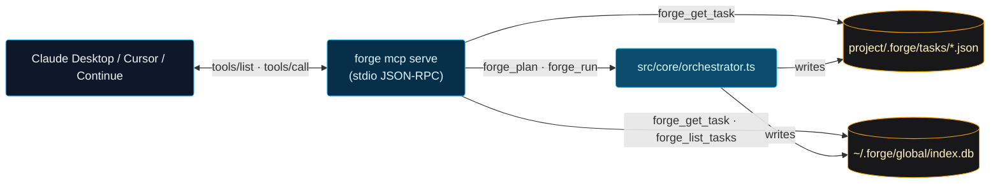

# Forge as an MCP server

Forge can run as a [Model Context Protocol](https://modelcontextprotocol.io) server, exposing its planner, executor, and task store as MCP tools. Other agents — Claude Desktop, Cursor, Continue, Zed, your own MCP client — register Forge once and can plan or run tasks through their own chat surfaces, with no shell round-trip and no special integration code.

## What gets exposed

Two tiers, by trust level.

### Read-only tier (always on)

| Tool | What it does | Side effects |
|---|---|---|
| `forge_status` | Runtime info: version, default provider, available providers, cwd. | None. |
| `forge_plan` | Generate a plan for a task without executing. Returns the plan JSON. | None — `planOnly: true`. |
| `forge_get_task` | Look up a task by ID. Resolves the project automatically from the global index. | None — read from `~/.forge/global/index.db` and the project's task JSON. |
| `forge_list_tasks` | Recent tasks newest-first. Filter by `status` or `projectId`. | None. |

### Execute tier (opt-in)

Enabled by `--allow-execute` or `FORGE_MCP_ALLOW_EXECUTE=true`. **These tools modify your project.**

| Tool | What it does | Side effects |
|---|---|---|
| `forge_run` | Full classify → plan → execute → verify. Permission prompts are auto-approved (`skipRoutine: true`, `allowFiles: true`, `allowShell: true`) because MCP cannot show interactive UI. | Writes files, runs shell commands, makes model calls. |
| `forge_cancel_task` | Cancel a live task by ID. Idempotent — already-terminal tasks return their current state without retransitioning. | Updates the task's status. |

## Quick start

```bash
# 1. Install Forge if you haven't
npm install -g @hoangsonw/forge

# 2. Sanity check
forge mcp serve --help
```

## Wire it up

### Claude Desktop

Edit your config file:

- macOS: `~/Library/Application Support/Claude/claude_desktop_config.json`
- Windows: `%APPDATA%\Claude\claude_desktop_config.json`
- Linux: `~/.config/Claude/claude_desktop_config.json`

```json
{
  "mcpServers": {
    "forge": {
      "command": "forge",
      "args": ["mcp", "serve"],
      "env": {}
    }
  }
}
```

To enable execution tools as well:

```json
{
  "mcpServers": {
    "forge": {
      "command": "forge",
      "args": ["mcp", "serve", "--allow-execute"]
    }
  }
}
```

Restart Claude Desktop. The Forge tools appear under the 🔌 icon.

### Cursor

`~/.cursor/mcp.json` (or `Cmd+Shift+P → MCP: Edit Configuration`):

```json
{
  "mcpServers": {
    "forge": {
      "command": "forge",
      "args": ["mcp", "serve"]
    }
  }
}
```

### Any MCP client

The transport is plain stdio JSON-RPC. Spawn `forge mcp serve` (or `forge mcp serve --allow-execute`) and follow the [MCP spec](https://modelcontextprotocol.io/specification).

## Flags

| Flag | Default | Notes |
|---|---|---|
| `--allow-execute` | off | Adds `forge_run` and `forge_cancel_task`. |
| `--cwd <path>` | `process.cwd()` | Default working directory used when a tool call doesn't specify one. |

Environment variables:

| Var | Effect |
|---|---|
| `FORGE_MCP_ALLOW_EXECUTE=true` | Same as `--allow-execute`. Useful when the MCP client doesn't let you customize args. |

## Tool reference

### `forge_status`

```jsonc
// input
{}

// output
{
  "version": "1.0.0",
  "provider": "ollama",
  "defaultMode": "balanced",
  "cwd": "/Users/me/work/project",
  "providers": [
    { "name": "ollama", "available": true },
    { "name": "anthropic", "available": false }
  ],
  "allowExecute": false
}
```

### `forge_plan`

```jsonc
// input
{
  "task": "Add a /healthz endpoint and a test for it.",
  "cwd": "/Users/me/work/project"   // optional
}

// output
{
  "taskId": "task_22ce1f014275",
  "plan": { "steps": [ /* … */ ] },
  "summary": "…",
  "status": "planned"
}
```

### `forge_run`  (requires `--allow-execute`)

```jsonc
// input
{
  "task": "Fix the failing test in src/server.test.ts.",
  "mode": "balanced"   // optional; "balanced" or "risky"
}

// output
{
  "taskId": "task_…",
  "status": "completed",
  "success": true,
  "summary": "Fixed.",
  "filesChanged": ["src/server.ts"],
  "durationMs": 18412,
  "costUsd": 0
}
```

### `forge_get_task`

```jsonc
// input
{ "taskId": "task_22ce1f014275" }

// output: full Task JSON (id, prompt, plan, status, result, …)
```

Resolves the project automatically — works for tasks created in any project on the host, not just `cwd`.

### `forge_list_tasks`

```jsonc
// input
{ "limit": 20, "status": "completed", "projectId": "proj_xxx" }   // all optional

// output
[
  { "id": "task_…", "title": "…", "status": "completed", "mode": "balanced",
    "updated_at": "2026-04-27T12:00:00Z", "attempts": 1, "project_id": "…" },
  …
]
```

### `forge_cancel_task`  (requires `--allow-execute`)

```jsonc
// input
{ "taskId": "task_…" }

// output
{ "taskId": "task_…", "status": "cancelled" }
// or, on an already-terminal task:
{ "taskId": "task_…", "status": "completed", "alreadyTerminal": true }
```

## Permission model

When called from an MCP client, Forge cannot show an interactive permission prompt. Instead:

- **Read-only tools** never need permission — they don't trigger the permission manager at all.
- **`forge_run`** sets `skipRoutine: true`, `allowFiles: true`, `allowShell: true`, `nonInteractive: true`. Critical-risk shell commands (classified by `src/sandbox/shell.ts`) are still hard-blocked.
- **`forge_cancel_task`** is a state-machine transition, not a tool invocation, so the permission manager isn't involved.

This means: enabling `--allow-execute` is a meaningful trust decision. The calling agent is allowed to write files and run shell commands inside whatever directory you set as `--cwd` (or wherever Forge was launched from). Pair it with sandboxing if the calling agent isn't fully trusted.

## Architecture



The MCP server is a thin shim — it doesn't reimplement orchestration, it calls the same `orchestrateRun()` that the CLI / REPL / dashboard use, and it reads from the same SQLite index that powers the dashboard's task list. So a plan generated through Claude Desktop and a plan generated through `forge run` are byte-identical paths.

## Troubleshooting

- **`forge: command not found`** — confirm `forge` is on your PATH (`which forge`). If you installed it via nvm, the MCP client may need an absolute path: `"command": "/Users/you/.nvm/versions/node/v20.x/bin/forge"`.
- **Tools don't appear in Claude Desktop** — check the Claude logs (`~/Library/Logs/Claude/`) for MCP connection errors. The most common cause is a typo in the JSON config.
- **`forge_run` not exposed** — you forgot `--allow-execute` (or `FORGE_MCP_ALLOW_EXECUTE=true`). Read-only is the default for safety.
- **Cross-project task lookups fail** — make sure the projects you want to access have been opened by `forge` at least once so they're indexed in `~/.forge/global/index.db`.

## Related

- [`docs/ARCHITECTURE.md` §9.2](ARCHITECTURE.md) — where the MCP server fits in the surface map.
- [`vscode-extension/README.md`](../vscode-extension/README.md) — the in-editor surface, complementary to the MCP server.
- [`actions/forge-run/README.md`](../../actions/forge-run/README.md) — the GitHub Action surface.
