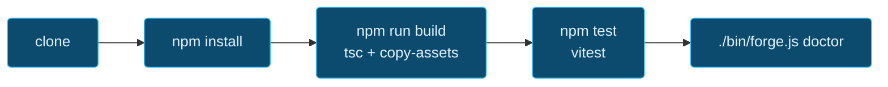
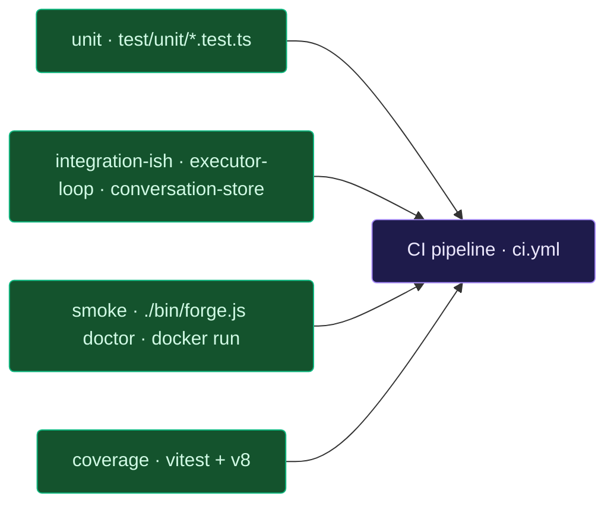
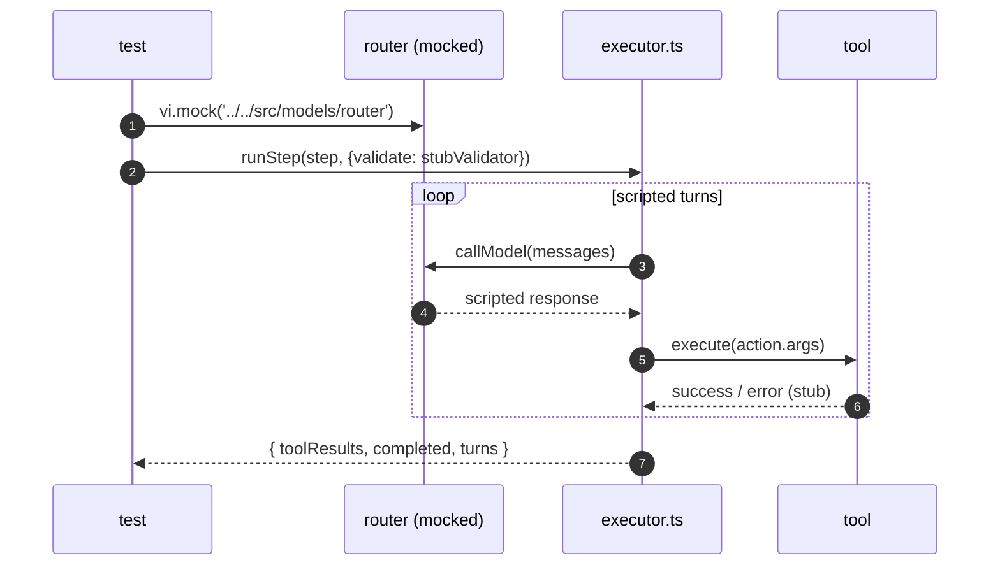
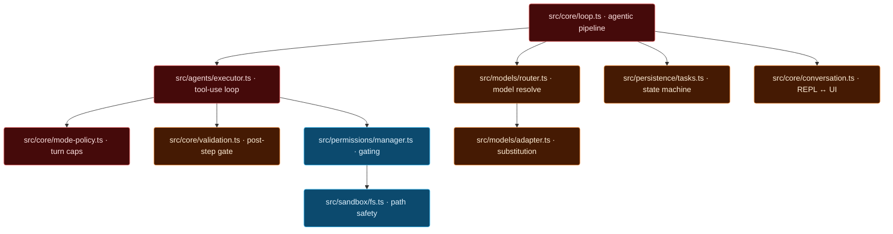

# Forge — Developer setup

> Contributor guide. For end-user install, see [INSTALL.md](INSTALL.md).
> For the engineering map, see [ARCHITECTURE.md](ARCHITECTURE.md).

## Table of contents

- [1. Prerequisites](#1-prerequisites)
- [2. Clone, install, verify](#2-clone-install-verify)
- [3. Project layout tour](#3-project-layout-tour)
- [4. Everyday tasks](#4-everyday-tasks)
- [5. Testing](#5-testing)
- [6. Linting & formatting](#6-linting--formatting)
- [7. Running locally (CLI, REPL, UI, daemon)](#7-running-locally-cli-repl-ui-daemon)
- [8. Debugging tips](#8-debugging-tips)
- [9. Adding things](#9-adding-things)
- [10. Performance + restraint checklist](#10-performance--restraint-checklist)
- [11. Commit workflow](#11-commit-workflow)

---

## 1. Prerequisites

| | Version |
|---|---|
| Node.js | ≥ 20 (22 tested) |
| npm | bundled with Node |
| git | any |
| ripgrep | optional but recommended — used by tools |
| Docker (for image work) | ≥ 25 |

Optional: Ollama / LM Studio / vLLM / llama.cpp for testing against a real
local model. Hosted `ANTHROPIC_API_KEY` / `OPENAI_API_KEY` also works.

---

## 2. Clone, install, verify

```bash
git clone https://github.com/forge/forge && cd forge
npm install
npm run build
npm test              # 203 tests across 38 files; all must pass
./bin/forge.js doctor # sanity check
```



---

## 3. Project layout tour

The short version (full tree in [ARCHITECTURE.md §13](ARCHITECTURE.md#13-directory-map)):

```
src/
  cli/           commander CLI + REPL + input editor (5,200 LoC)
  core/          orchestrator, agentic loop, mode policy, validation
  agents/        6 agents
  models/        6 providers + router + adapter + catalog
  tools/         18 tools
  permissions/   risk classifier, interactive manager, trust calibration
  sandbox/       path-safe fs + command-risk classifier
  persistence/   tasks/sessions/conversations/events + SQLite index
  memory/        hot/warm/cold/learning
  ui/            HTTP + WS dashboard + static app shell
test/            38 test files, 203 tests
docs/            you are here
docker/          Dockerfile + docker-compose.yml
.github/workflows/  ci.yml, release.yml, nightly.yml
scripts/         metrics.sh, copy-assets.js, …
```

---

## 4. Everyday tasks

| Task | Command |
|------|---------|
| Full build | `npm run build` (tsc + asset copy) |
| Watch mode | `npm run build:watch` |
| Run all tests | `npm test` |
| Run one test file | `npx vitest run test/unit/<file>.test.ts` |
| Coverage | `npm run test:coverage` → `coverage/index.html` |
| Typecheck only | `npm run typecheck` |
| Lint | `npm run lint` |
| Format | `npm run format` (writes) / `npm run format:check` (reads) |
| Regenerate metrics | `bash scripts/metrics.sh` |
| Build Docker image | `docker build -f docker/Dockerfile -t forge/core:dev .` |
| Run the dashboard | `./bin/forge.js ui start` |

---

## 5. Testing

### Test anatomy



### Mocking pattern for model-backed code



See [`test/unit/executor-loop.test.ts`](../test/unit/executor-loop.test.ts)
for the working template.

Notes:

- Vitest is configured in `vitest.config.ts`. Tests use Node test env
  (no jsdom). No network calls — use stubs (see `adapter.test.ts` and
  `executor-loop.test.ts` for patterns).
- `test/unit/executor-loop.test.ts` shows how to stub `callModel` with
  `vi.mock` to exercise the iterative tool-use loop.
- Adding a test that hits disk: use `fs.mkdtempSync(path.join(os.tmpdir(), 'forge-…'))`
  and clean up in `afterEach`.

---

## 6. Linting & formatting

- ESLint + Prettier. Config in `package.json` / `.eslintrc.*`.
- CI gates (`format`, `lint`) must be green — run `npm run format`
  before pushing.
- Warning budget: `--max-warnings=100`. Prefer fixing over silencing.

---

## 7. Running locally (CLI, REPL, UI, daemon)

```bash
./bin/forge.js doctor              # health check
./bin/forge.js                     # REPL (default mode)
./bin/forge.js run "your task"     # one-shot
./bin/forge.js ui start            # dashboard at :7823
./bin/forge.js daemon start        # optional background process
./bin/forge.js model list          # what your providers expose
```

Env vars useful during dev:

| Env | Effect |
|-----|--------|
| `FORGE_HOME` | override `~/.forge` (handy for isolated CI runs) |
| `FORGE_LOG_LEVEL=debug` | verbose tracing |
| `FORGE_LOG_STDOUT=1` | mirror logs to stdout (otherwise file-only) |
| `FORGE_DETERMINISTIC=1` | fixed temperatures |
| `OLLAMA_ENDPOINT` | point at a non-default Ollama |
| `OPENAI_BASE_URL` | any OpenAI-compatible server |

---

### Hot paths for debugging



## 8. Debugging tips

- **Hot path is `src/core/loop.ts`.** Start there when tracking a bug
  through the agentic pipeline.
- **Executor turns are in `src/agents/executor.ts`.** Add a `log.debug`
  inside the tool-use loop to see every model ↔ tool hand-off.
- **State-machine rejections** throw `state_invalid` with the legal-next
  list in `recoveryHint` — read the hint before guessing.
- **`forge doctor --no-banner`** is the fastest way to confirm which
  providers the router sees as up.
- **Events log:** `~/.forge/logs/events.jsonl` is append-only JSONL and
  trivially `jq`-queryable.

---

## 9. Adding things

### Developer loop


Tight conventions keep the codebase legible:

**A new tool**

1. Add `src/tools/<name>.ts` that exports a `Tool<Args, Output>`.
2. Register it in `src/tools/registry.ts`.
3. Wire a default permission risk via `schema.risk` and `schema.sideEffect`.
4. Unit test in `test/unit/<name>.test.ts`.

**A new provider**

1. Implement `ModelProvider` in `src/models/<name>.ts`.
2. Register in `src/models/registry.ts#initProviders`.
3. Add to `providerEnum` in `src/config/schema.ts`.
4. Add to `isLocalProvider` if it's a local runtime.
5. Test registration in `test/unit/providers-registry.test.ts`.

**A new agent**

1. Implement `Agent` in `src/agents/<name>.ts`.
2. Register in `src/agents/registry.ts`.
3. Call from `src/core/loop.ts` at the right lifecycle phase.

**A new CLI command**

1. Add `src/cli/commands/<name>.ts` exporting a `Command`.
2. Register in `src/cli/index.ts`.
3. Describe it in README if it's user-facing.

---

## 10. Performance + restraint checklist

Treat this list as a soft gate on PRs. Forge is meant to be fast and
unobtrusive — it runs on laptops, often alongside an Ollama eating RAM.

Measured today (reproduce with the same commands):

| Target | Claim | Measured | How |
|--------|-------|----------|-----|
| `forge --help` cold-start | < 250 ms | **238 ms** | `time node bin/forge.js --help` |
| `forge doctor` cold-start | < 1 s | **173 ms** | `time node bin/forge.js doctor --no-banner` |
| UI `app.js` uncompressed | < 100 KB | **89 KB** | `wc -c src/ui/public/app.js` |
| Landing `index.html` | self-contained, < 30 KB | **25 KB** | `wc -c index.html` |
| Full test suite wall-clock | < 5 s | **~3.3 s** | `npx vitest run` |
| Container image | reasonable for prod | **~355 MB** | `docker images` |
| CDN fetches at runtime | 0 | 0 | inspect `index.html`, `app.js` |


- [ ] No new synchronous disk reads on hot paths (REPL redraw, UI poll).
- [ ] No new polling loops < 1 s unless there's a good reason.
- [ ] Watchers are ref-counted (see `src/ui/chat.ts`).
- [ ] New commands under 200 ms cold on a no-op (e.g. `forge status`).
- [ ] New UI features don't add > 20 KB to `app.js` uncompressed.
- [ ] Logs default to `info`, not `debug`.
- [ ] New model calls respect mode caps (`src/core/mode-policy.ts`).
- [ ] Don't add CDN fetches to UI assets — keep it self-contained.

---

## 11. Commit workflow

- One logical change per commit. Avoid "misc fixes" commits.
- Messages follow the existing repo style (`verb: short summary`).
- Don't bypass hooks (`--no-verify`) without explicit approval.
- PR checklist:
  - [ ] `npm run build` clean
  - [ ] `npm test` green
  - [ ] `npm run format:check` + `npm run lint` green
  - [ ] Docs updated if you touched anything in §9 above
  - [ ] Metrics regenerated if you added a subsystem (`bash scripts/metrics.sh`)
