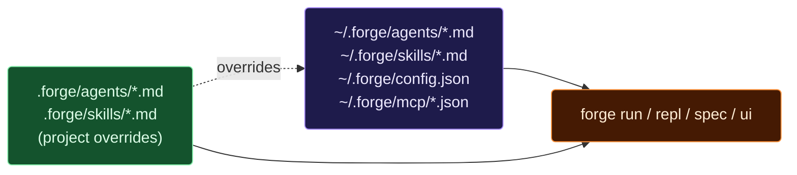
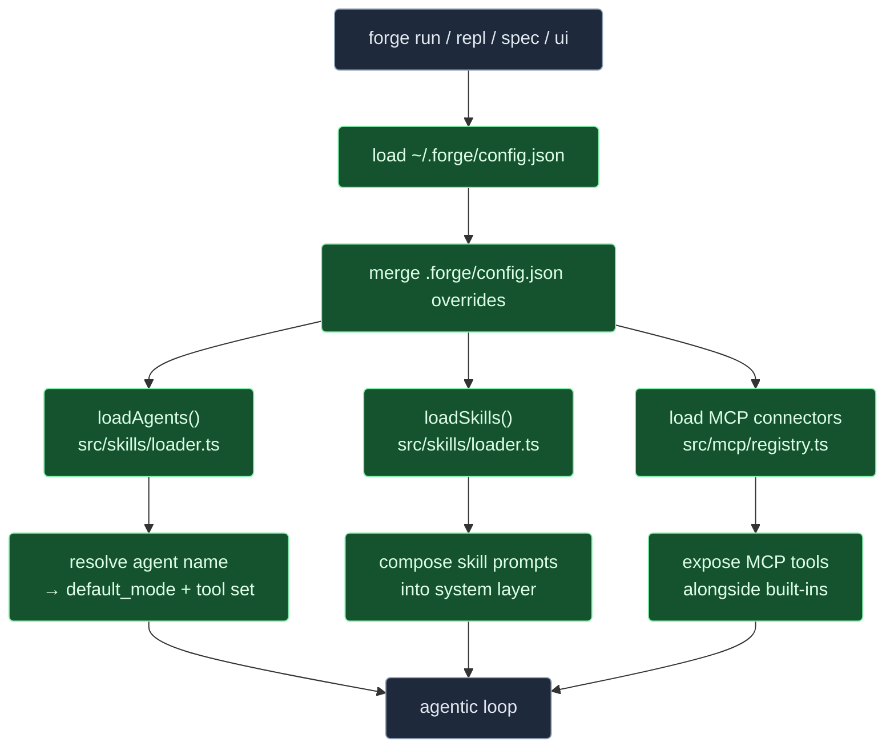

# Examples

Drop-in building blocks for Forge — agents, skills, configs, spec files,
MCP connectors, CI recipes, and prompt patterns. Everything here is
copy-paste-ready; file names, schemas, and directory layout match what
the CLI actually loads.

> If you're new to Forge, start with the top-level [README](../README.md)
> and [docs/SETUP.md](../docs/SETUP.md). This directory is the "okay, now
> what can I do with it" answer.

---

## Table of contents

1. [What's in this directory](#whats-in-this-directory)
2. [Where things go on disk](#where-things-go-on-disk)
3. [Agents](#agents)
4. [Skills](#skills)
5. [Configs](#configs)
6. [Specs (for `forge spec`)](#specs-for-forge-spec)
7. [MCP connectors](#mcp-connectors)
8. [Workflows (CI recipes)](#workflows-ci-recipes)
9. [Prompt recipes](#prompt-recipes)
10. [How Forge loads these files](#how-forge-loads-these-files)

---

## What's in this directory

```
examples/
├── README.md            ← you are here
├── agents/              ← custom agent manifests
├── skills/              ← reusable workflows
├── configs/             ← ~/.forge/config.json templates
├── specs/               ← spec files for `forge spec`
├── mcp/                 ← MCP server connector configs
├── workflows/           ← CI/CD workflow recipes
└── prompts/             ← natural-language prompt patterns
```

Each subdirectory has its own README explaining the shape and gotchas.

---

## Where things go on disk

Forge loads agents, skills, and MCP connections from two places —
**global** (shared across projects) and **project** (this project only):



**Project-level files win** on name collision. That's how you override a
global skill for one repo without forking it.

**Copy an example into place:**

```bash
# Global (all projects).
mkdir -p ~/.forge/agents
cp examples/agents/backend-api-developer.md ~/.forge/agents/

# Project only.
mkdir -p .forge/skills
cp examples/skills/fix-flaky-test.md .forge/skills/
```

---

## Agents

An **agent** is a named personality with a preferred set of tools, a
default mode, and a behavioral prompt. Use them when a whole class of
tasks benefits from the same defaults ("always use TypeScript", "run
tests after every edit", "never introduce Redux").

| Example | When to use |
|---|---|
| [`react-specialist.md`](agents/react-specialist.md) | React / Next.js UI work |
| [`backend-api-developer.md`](agents/backend-api-developer.md) | REST / tRPC / GraphQL API work in Node |
| [`python-data-scientist.md`](agents/python-data-scientist.md) | Python data/ML notebooks + pipelines |
| [`go-systems-engineer.md`](agents/go-systems-engineer.md) | Go services with strict concurrency rules |
| [`rust-systems-developer.md`](agents/rust-systems-developer.md) | Rust with `cargo` + `clippy` + `miri` |
| [`devops-engineer.md`](agents/devops-engineer.md) | Docker, Kubernetes, Terraform changes |
| [`docs-writer.md`](agents/docs-writer.md) | Docs-only changes with tight prose rules |

**Frontmatter schema** (loaded by `src/skills/loader.ts`):

```yaml
---
name: my-agent            # unique; project beats global
description: one-liner shown in lists
capabilities: [...]       # free-form tags
default_mode: balanced    # fast | balanced | heavy | plan | execute | audit | debug | architect | offline-safe
tools: [...]              # tool names from DEFAULT_TOOL_NAMES
skills: [...]             # skill names to expose by default
---

## Behavior

Free-form markdown; injected into the system prompt when the agent runs.
```

Invoke: `forge run --agent backend-api-developer "add POST /orders"`.

---

## Skills

A **skill** is a reusable workflow — a recipe for a specific task shape
("fix a flaky test", "bump a dependency safely"). Skills are composable;
an agent can pull several in via its `skills: [...]` list, or you can
invoke them with `forge run --skill <name>`.

| Example | What it does |
|---|---|
| [`write-unit-tests.md`](skills/write-unit-tests.md) | Generate unit tests for a target file |
| [`security-audit.md`](skills/security-audit.md) | Read-only security sweep (OWASP top 10) |
| [`fix-flaky-test.md`](skills/fix-flaky-test.md) | Reproduce → localize → de-flake → gate |
| [`add-logging.md`](skills/add-logging.md) | Instrument a function with structured logs |
| [`extract-function.md`](skills/extract-function.md) | Safely hoist code into a reusable helper |
| [`dependency-upgrade.md`](skills/dependency-upgrade.md) | Bump a single dep with regression check |
| [`add-feature-flag.md`](skills/add-feature-flag.md) | Wrap a code path behind a toggle |
| [`add-ci-workflow.md`](skills/add-ci-workflow.md) | Add a GitHub Actions workflow |
| [`generate-api-docs.md`](skills/generate-api-docs.md) | Produce OpenAPI / route docs from source |
| [`debug-race-condition.md`](skills/debug-race-condition.md) | Systematic repro + fix for races |
| [`migrate-database.md`](skills/migrate-database.md) | Write + test a safe DB migration |

**Frontmatter schema**:

```yaml
---
name: fix-flaky-test
description: Reproduce, localize, de-flake, then guard.
inputs: [test_name, iterations]
tools: [read_file, run_tests, grep]
tags: [testing, reliability]
---

## Instructions

Free-form markdown, shown to the model as a playbook when the skill runs.
```

---

## Configs

Templates for `~/.forge/config.json`. Each is annotated and ready to
copy. See [`configs/README.md`](configs/README.md) for a schema
walkthrough.

| Example | Use case |
|---|---|
| [`local-only.json`](configs/local-only.json) | Fully offline — Ollama only, no cloud providers |
| [`cloud-hybrid.json`](configs/cloud-hybrid.json) | Local first, Claude/OpenAI fallback |
| [`ci-non-interactive.json`](configs/ci-non-interactive.json) | Headless CI — all prompts auto-deny except low-risk routine |
| [`enterprise.json`](configs/enterprise.json) | Strict mode — signed releases only, no nightly channel, trust calibration off |

---

## Specs (for `forge spec`)

Feed one of these files to `forge spec <file>` to run a full, structured
task against it. The spec's top-level `#` heading is the task title; a
`## Tasks` or `## Requirements` section becomes a checklist the agent
tries to land.

| Example | What it models |
|---|---|
| [`feature-user-auth.md`](specs/feature-user-auth.md) | Green-field feature with acceptance criteria |
| [`bugfix-memory-leak.md`](specs/bugfix-memory-leak.md) | Debug flow: reproduce, localize, fix, test |
| [`refactor-extract-service.md`](specs/refactor-extract-service.md) | Pure refactor with guardrails |

See [`specs/README.md`](specs/README.md) for the spec grammar.

---

## MCP connectors

Drop a JSON file in `~/.forge/mcp/` (or `./.forge/mcp/`) to connect an
MCP server. Shapes match `McpConnection` in `src/types/index.ts`.

| Example | Server |
|---|---|
| [`filesystem-server.json`](mcp/filesystem-server.json) | `@modelcontextprotocol/server-filesystem` (stdio) |
| [`github-server.json`](mcp/github-server.json) | GitHub MCP over stdio with `GITHUB_TOKEN` |
| [`postgres-server.json`](mcp/postgres-server.json) | Postgres MCP over stdio |

See [`mcp/README.md`](mcp/README.md) for the full connector schema and
auth tips.

---

## Workflows (CI recipes)

GitHub Actions snippets that integrate Forge into a PR workflow.

| Example | Triggers |
|---|---|
| [`ci-pr-check.yml`](workflows/ci-pr-check.yml) | Run `forge audit` on every pull request |
| [`nightly-deps-bump.yml`](workflows/nightly-deps-bump.yml) | Nightly cron to open dep-bump PRs |

Paste into `.github/workflows/` and tweak paths.

---

## Prompt recipes

Not a folder of configs — an annotated list of natural-language prompts
showing the range of what `forge run "..."` handles well, from one-shot
edits to multi-step features. See
[`prompts/README.md`](prompts/README.md).

---

## How Forge loads these files



Everything in this directory plugs into that pipeline without code
changes — just drop the file in the right place.
