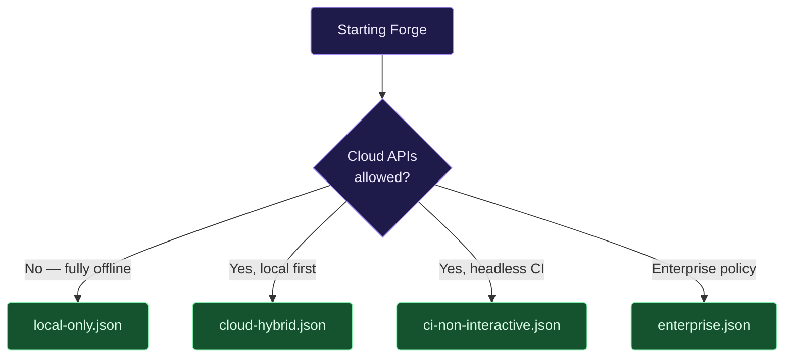

# Configs

Templates for `~/.forge/config.json`. Copy the closest match and tweak;
Forge merges project-level overrides from `./.forge/config.json`.

The schema of record is [`src/config/schema.ts`](../../src/config/schema.ts).
Unknown fields are dropped; required fields fall back to safe defaults.

## Pick a starting point

| File | Highlights |
|---|---|
| [`local-only.json`](local-only.json) | Ollama only, no outbound cloud, no auto-update probe |
| [`cloud-hybrid.json`](cloud-hybrid.json) | Ollama primary, Anthropic fallback, prompt cache on |
| [`ci-non-interactive.json`](ci-non-interactive.json) | Headless — skip routine prompts, deny interactive |
| [`enterprise.json`](enterprise.json) | Strict permissions, no nightly channel, trust calibration off |

## Where this file lives

| Scope | Path | Wins on collision |
|---|---|---|
| Global | `~/.forge/config.json` | baseline |
| Project | `./.forge/config.json` | ✅ overrides global |

## After editing

Run `forge doctor --no-banner` to validate the config. Forge will print
a merged, redacted view and call out anything it dropped.
