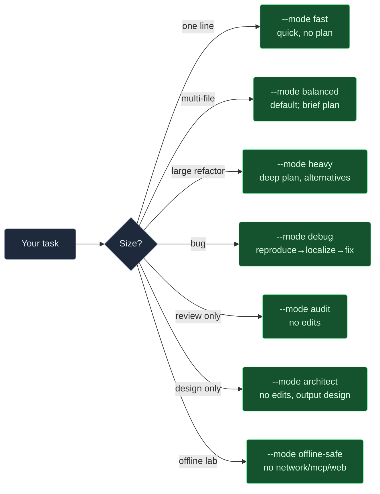

# Prompt recipes

Natural-language prompts that work well with `forge run "..."`. Each
recipe includes what the agent will typically do and any flags worth
knowing.

## Table of contents

- [One-shot edits](#one-shot-edits)
- [Multi-file changes](#multi-file-changes)
- [Bug hunting](#bug-hunting)
- [Refactoring](#refactoring)
- [Test authoring](#test-authoring)
- [Documentation](#documentation)
- [Analysis (read-only)](#analysis-read-only)
- [Spec-driven flows](#spec-driven-flows)
- [Mode cheat sheet](#mode-cheat-sheet)

---

## One-shot edits

Tiny, focused changes. `--mode fast` is fine.

```bash
forge run --mode fast \
  "rename the variable `tmp` to `buffer` inside src/lib/codec.ts"

forge run --mode fast \
  "add a TODO comment above the main() function in cmd/server/main.go explaining that graceful shutdown is a follow-up"

forge run --mode fast \
  "fix the typo 'recieve' → 'receive' everywhere in src/"
```

## Multi-file changes

Use `--mode balanced` (default) for anything that needs planning.

```bash
forge run \
  "introduce a UserRepository interface in src/repos/user.ts, update UserService and AuthService to depend on it, and keep the existing tests green"

forge run \
  "switch the project's logger from console.log to pino. Update package.json, wire up a shared logger in src/logger.ts, and replace console.log call sites in src/ but not in tests."
```

## Bug hunting

Prefer `--mode debug` — the agent explicitly reproduces → localizes →
fixes → guards.

```bash
forge run --mode debug \
  "intermittent 500 on POST /orders under load. See test/load/orders.log for a sample trace. Reproduce, localize, fix, and add a regression test."

forge run --mode debug \
  "`forge doctor` hangs on a broken ollama endpoint. Reproduce by setting ollama.endpoint=http://127.0.0.1:1, fix the timeout so the whole command completes in under 3s, add a test."
```

## Refactoring

Prefer `--mode heavy` for multi-file refactors that need careful
planning, `--mode plan` to see the plan without execution.

```bash
forge run --mode plan \
  "propose a plan for extracting BillingService out of src/routes/checkout.ts. Don't touch any files."

forge run --mode heavy \
  "execute the plan we just discussed. One commit per step. Stop if tests go red."
```

## Test authoring

```bash
forge run --agent backend-api-developer --skill write-unit-tests \
  "write unit tests for src/services/payment.ts covering happy path, payment declined, gateway timeout, and idempotency-key replay"

forge run --skill fix-flaky-test \
  "the test 'orders create with coupon' in test/integration/orders.test.ts fails ~1/20 runs. Reproduce, fix, and guard."
```

## Documentation

```bash
forge run --agent docs-writer \
  "write a README for src/lib/rate-limiter/ explaining the algorithm, the tuning knobs, and when NOT to use it"

forge run --agent docs-writer --skill generate-api-docs \
  "generate an OpenAPI 3.1 spec for every route in src/routes/, output to docs/openapi.yaml"
```

## Analysis (read-only)

`--mode audit` prevents edits. Great for "explain this" or "review
this".

```bash
forge run --mode audit \
  "walk the request path for POST /orders. Tell me every function it touches and any IO it performs. Don't modify anything."

forge run --mode audit --skill security-audit \
  "audit src/auth/ for the OWASP top 10. Output a severity-sorted table."
```

## Spec-driven flows

When the task is big enough to deserve a written spec:

```bash
forge spec examples/specs/feature-user-auth.md

# Stop after the plan — useful for reviewing intent first
forge spec examples/specs/feature-user-auth.md --plan-only

# Use a specific agent for the spec
forge spec examples/specs/refactor-extract-service.md \
  --agent backend-api-developer
```

## Mode cheat sheet



## Prompt-writing tips

- **Name files**. "Fix the SSE handler" is worse than "fix
  src/routes/events.ts". The planner uses grep but you save a step.
- **Declare non-goals**. "Don't touch tests" or "keep the public API".
  Saves an apologetic diff later.
- **Specify the format** when you care. "Output a markdown table with
  columns file, severity, fix".
- **Budget the scope**. "Make the minimal change" / "prefer the boring
  solution" / "three commits max".
- **Pin the framework** when ambiguous. "Add a zod validator" not "add
  validation".
